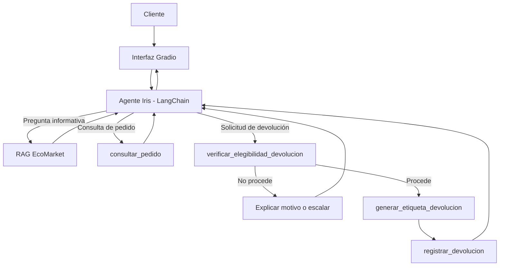

# Fase 1. Diseño de la arquitectura del agente

## Punto de partida

En el Taller 2 ya teníamos un sistema RAG para Iris. La base de conocimiento se consultaba por similitud y los pedidos se buscaban de forma exacta por su número de seguimiento. Para este proyecto no reemplazamos ese trabajo. Lo convertimos en una parte del conjunto de herramientas que puede usar el agente.

La diferencia principal es que Iris ya no solamente responde. En una solicitud de devolución puede comprobar condiciones, generar una etiqueta y registrar el caso.

## Arquitectura

El LLM decide qué herramienta necesita de acuerdo con el mensaje del cliente, pero las reglas que permiten o bloquean una devolución no quedan a criterio del modelo. Están implementadas en código.

## Herramientas

### 1. `consultar_base_conocimiento`

Es la ruta RAG del Taller 2 convertida en una herramienta. Recupera fragmentos de la política, preguntas frecuentes y guía de envíos y pagos.

**Entrada**

- `consulta`: pregunta del cliente.

**Salida**

- fragmentos recuperados;
- fuente de cada fragmento;
- método de recuperación.

Esta herramienta **no cuenta** dentro de las dos herramientas adicionales exigidas para el agente.

### 2. `consultar_pedido`

Busca un número de seguimiento en `pedidos.json`.

**Entrada**

- `numero_pedido`.

**Salida**

- estado;
- fecha de entrega;
- productos;
- transportadora;
- existencia de una devolución previa.

Aunque esta herramienta es sencilla, evita que el modelo invente información transaccional.

### 3. `verificar_elegibilidad_devolucion`

Aplica las reglas antes de permitir cualquier acción.

**Entrada**

- número de pedido;
- SKU;
- motivo informado por el cliente;
- condición del producto.

**Salida**

- `elegible`;
- `requiere_agente_humano`;
- explicación;
- código de autorización cuando procede.

La función revisa:

1. que el pedido exista;
2. que el producto pertenezca al pedido;
3. que el pedido esté entregado;
4. que no exista una devolución previa;
5. el plazo de 30 días;
6. la categoría del producto;
7. las excepciones de la política;
8. la condición informada del producto.

### 4. `generar_etiqueta_devolucion`

Genera una etiqueta simulada de retorno.

**Entrada**

- código de autorización entregado por la herramienta anterior.

**Salida**

- número de caso `DEV-AAAA-NNNN`;
- número de etiqueta;
- transportadora;
- instrucciones.

La herramienta no acepta un pedido directamente. Exige un código de autorización válido. Con esto se evita que el modelo se salte la verificación.

### 5. `registrar_devolucion`

Cierra la acción del agente y registra el caso en el estado local de la demostración.

**Entrada**

- número de etiqueta generado.

**Salida**

- número de caso;
- pedido;
- SKU;
- estado del registro.

También valida que la devolución no haya sido registrada antes.

## Marco elegido

Elegimos **LangChain** porque ya estaba presente en el Taller 2 y permite mantener la integración con Gemini, mensajes, prompts y herramientas sin migrar el proyecto a otro ecosistema.

Para el proyecto final usamos el mecanismo de `tool calling`: las funciones se registran como herramientas de LangChain y se entregan al modelo con `bind_tools`. Cuando Gemini solicita una herramienta, el programa la ejecuta y devuelve el resultado al modelo. El ciclo termina cuando Iris produce una respuesta sin nuevas llamadas.

Esta opción fue preferible a cambiar a LlamaIndex porque:

- reutiliza el código y las dependencias del Taller 2;
- permite exponer el RAG como una herramienta;
- las funciones de negocio se pueden probar de forma independiente;
- las llamadas de herramientas quedan visibles para auditoría;
- no obliga a delegar las reglas críticas al LLM.

## Flujo de una devolución

El flujo esperado es:

1. El cliente indica que desea devolver un producto.
2. Iris consulta el pedido si necesita confirmar los productos disponibles.
3. Iris llama a `verificar_elegibilidad_devolucion`.
4. Si no procede, explica el motivo.
5. Si el caso necesita revisión humana, se detiene el proceso automático.
6. Si procede, la herramienta devuelve un código de autorización.
7. Iris usa ese código en `generar_etiqueta_devolucion`.
8. Iris registra la devolución con `registrar_devolucion`.
9. La respuesta final resume lo ocurrido y entrega al cliente la información del caso.

No se permite ejecutar los pasos 7 y 8 sin haber superado los controles anteriores.
