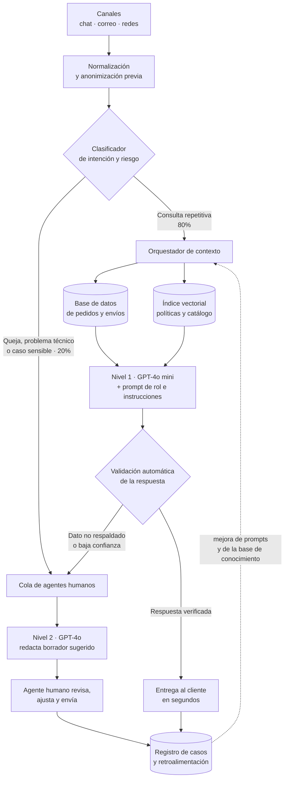

# Fase 1 · Selección y justificación del modelo de IA generativa

**Caso:** optimización de la atención al cliente en EcoMarket
**Autores:** William Alberto Suaza · Anderson Trujillo · Bairon Gutiérrez

---

## 1. Qué debe resolver la solución

Partimos de los hechos que describe el caso y los traducimos a requisitos técnicos, porque la
elección del modelo solo tiene sentido frente a ellos.

| Hecho del caso                                                       | Requisito técnico que impone                                               |
| -------------------------------------------------------------------- | -------------------------------------------------------------------------- |
| Miles de consultas diarias por chat, correo y redes                  | Alta concurrencia y un único núcleo de razonamiento reutilizable por canal |
| 80% de consultas repetitivas sobre pedidos, devoluciones y productos | Acceso a datos transaccionales vivos con exactitud literal, no aproximada  |
| 20% de consultas complejas que exigen empatía                        | Capacidad de detectar el caso sensible y entregarlo a una persona          |
| Tiempo de respuesta promedio de 24 horas                             | Respuesta en segundos para el tramo automatizable                          |
| Crecimiento rápido de la empresa                                     | Escalar sin rediseñar la solución ni reentrenar modelos                    |
| Catálogo e información de envíos propios                             | Integración con base de datos y sistema logístico de EcoMarket             |

De aquí se desprende la tensión central del problema: **el 80% exige precisión sobre datos que
cambian cada hora y el 20% exige fluidez y sensibilidad humana**. Ningún enfoque único resuelve
bien las dos cosas, y esa constatación guía toda nuestra decisión.

## 2. Criterios de decisión

Ponderamos los criterios según el impacto que tienen sobre el problema declarado por EcoMarket.

| Criterio                              | Peso | Qué medimos                                                                        |
| ------------------------------------- | ---- | ---------------------------------------------------------------------------------- |
| Exactitud sobre datos transaccionales | 30%  | Probabilidad de entregar un estado de pedido o una regla de devolución incorrectos |
| Calidad conversacional y empatía      | 20%  | Naturalidad, tono de marca y manejo de clientes molestos                           |
| Costo total de propiedad              | 20%  | Costo por consulta más operación, mantenimiento y reentrenamiento                  |
| Escalabilidad                         | 15%  | Capacidad de absorber picos y crecimiento sin rediseño                             |
| Facilidad de integración              | 15%  | Esfuerzo para conectar con catálogo, pedidos, CRM y canales existentes             |

## 3. Alternativas evaluadas

| Alternativa                                                                            | Exactitud                                                           | Empatía               | Costo                                | Escalabilidad                | Integración                                            | Veredicto                                                                              |
| -------------------------------------------------------------------------------------- | ------------------------------------------------------------------- | --------------------- | ------------------------------------ | ---------------------------- | ------------------------------------------------------ | -------------------------------------------------------------------------------------- |
| **A.** LLM de propósito general, solo con prompts                                      | Baja: inventa estados y políticas                                   | Alta                  | Bajo por token                       | Alta                         | Muy sencilla                                           | Descartada: el riesgo de alucinación recae justo sobre el 80% del volumen              |
| **B.** Modelo pequeño afinado (fine-tuning) con el histórico de tickets                | Media: aprende estilo, no el dato de hoy                            | Alta en tono de marca | Alto por el ciclo de reentrenamiento | Media                        | Requiere infraestructura de entrenamiento y versionado | Descartada como núcleo: no resuelve el dato vivo y encarece cada cambio de política    |
| **C.** Modelo abierto autoalojado (Llama, Qwen)                                        | Media                                                               | Media                 | Alto en GPU, nulo por token          | Media, limitada por hardware | Alta carga de operación                                | Descartada en la fase inicial: exige un equipo de MLOps que EcoMarket todavía no tiene |
| **D.** Híbrida: LLM general + recuperación de datos + herramientas + derivación humana | **Alta: el dato proviene del sistema, no de la memoria del modelo** | Alta                  | Moderado y predecible                | Alta                         | Alta: se conecta a las APIs existentes                 | **Seleccionada**                                                                       |

El fine-tuning no queda descartado para siempre, pero lo reservamos para una fase posterior y con
un propósito acotado: ajustar el **tono** de marca sobre un modelo pequeño, nunca el **conocimiento**
de los pedidos.

## 4. Modelo seleccionado

Proponemos una **arquitectura híbrida con enrutamiento en dos niveles de modelo**:

| Nivel   | Modelo propuesto | Tramo que atiende                                                                        | Razón                                                                                                                                   |
| ------- | ---------------- | ---------------------------------------------------------------------------------------- | --------------------------------------------------------------------------------------------------------------------------------------- |
| Nivel 1 | **GPT-4o mini**  | El 80% repetitivo: estado de pedidos, devoluciones estándar, características de producto | Latencia baja y costo por consulta mínimo; con el dato recuperado en el contexto, la tarea es de redacción, no de razonamiento profundo |
| Nivel 2 | **GPT-4o**       | El 20% complejo: quejas, problemas técnicos, sugerencias, casos ambiguos                 | Mejor comprensión de matices, ironía y frustración; redacta el borrador que el agente humano revisa                                     |

## 5. Arquitectura propuesta

### Componentes y su papel

| Componente                         | Función                                                                                                            | Por qué es necesario                                                        |
| ---------------------------------- | ------------------------------------------------------------------------------------------------------------------ | --------------------------------------------------------------------------- |
| Normalización y anonimización      | Unifica el formato de los tres canales y enmascara datos sensibles antes de enviarlos al modelo                    | Reduce la superficie de exposición de información personal                  |
| Clasificador de intención y riesgo | Decide si la consulta es repetitiva, compleja o sensible                                                           | Es el mecanismo que materializa la división 80/20 del caso                  |
| Orquestador de contexto            | Consulta la base de pedidos por número de seguimiento y recupera los fragmentos de política y catálogo pertinentes | Evita que el modelo tenga que recordar el dato: se lo entregamos verificado |
| Índice vectorial                   | Almacena políticas, preguntas frecuentes y fichas de producto                                                      | Permite responder sobre documentación extensa sin inflar el prompt          |
| Validación automática              | Verifica que los números de pedido y fechas citados existan en el contexto recuperado                              | Corta la alucinación antes de que llegue al cliente                         |
| Cola de agentes humanos            | Recibe el 20% complejo y todo lo que la validación rechace                                                         | Preserva el criterio humano donde el caso lo exige                          |
| Registro de casos                  | Guarda consulta, contexto usado y respuesta entregada                                                              | Habilita auditoría y mejora continua de los prompts                         |

### Integración con los sistemas de EcoMarket

La solución no reemplaza los sistemas existentes, se apoya en ellos:

- **Pedidos y envíos:** consulta por número de seguimiento mediante la API transaccional; el modelo
  nunca accede directamente a la base de datos ni ejecuta consultas libres sobre ella.
- **Catálogo de productos:** sincronización periódica hacia el índice vectorial, con las fichas y
  las categorías que determinan si un producto admite devolución.
- **Políticas comerciales:** documentos versionados; al actualizarlos, la respuesta cambia sin tocar
  el modelo ni el código.
- **CRM y canales:** el asistente escribe en el mismo hilo del agente humano, de modo que la
  transición entre ambos es transparente para el cliente.

## 6. Justificación por criterio

### 6.1 Exactitud sobre datos transaccionales

Es el criterio de mayor peso y la razón principal de la arquitectura. Cuando el cliente pregunta por
el pedido `ECO-2026-1187`, el orquestador recupera ese registro y lo entrega al modelo dentro del
prompt. El modelo no recuerda: transcribe y redacta. Si el número no existe, el contexto lo declara
de forma explícita y la instrucción obliga a reconocerlo en lugar de improvisar.

### 6.2 Calidad conversacional y empatía

Un modelo de propósito general de última generación produce español natural sin entrenamiento
adicional. Sobre esa base, el prompt de rol fija la identidad de marca, el tuteo, la prohibición de
inventar y el momento de ceder el turno a una persona. Para el tramo complejo, el modelo de nivel 2
no responde directamente al cliente: **redacta un borrador que el agente humano revisa**, lo que
combina velocidad con criterio humano.

### 6.3 Costo

Estimamos el costo con un volumen de referencia de 3.000 consultas diarias y las tarifas públicas de
lista de los modelos propuestos, verificadas el 19 de septiembre de 2026 en las páginas oficiales de
precios de cada proveedor.

#### Tarifas de referencia

| Modelo                                     | Entrada (USD por millón de tokens) | Salida (USD por millón de tokens) | Fuente de la tarifa                              |
| ------------------------------------------ | ---------------------------------- | --------------------------------- | ------------------------------------------------ |
| GPT-4o mini                                | 0,15                               | 0,60                              | <https://developers.openai.com/api/docs/pricing> |
| GPT-4o                                     | 2,50                               | 10,00                             | <https://developers.openai.com/api/docs/pricing> |
| Gemini 3.6 Flash (alternativa equivalente) | 0,75                               | 3,75                              | <https://ai.google.dev/gemini-api/docs/pricing>  |

Páginas de precios consultadas:

- OpenAI, tabla completa de tarifas por modelo, incluidos los de generación anterior: <https://developers.openai.com/api/docs/pricing>
- OpenAI, resumen comercial de la API, que lista únicamente los modelos insignia vigentes: <https://openai.com/api/pricing/>
- Google, precios de la API de Gemini y condiciones del nivel gratuito: <https://ai.google.dev/gemini-api/docs/pricing>

#### Estimación de costo operativo

| Tramo                         | Volumen diario | Tokens aproximados por consulta  | Costo diario estimado | Costo mensual estimado |
| ----------------------------- | -------------- | -------------------------------- | --------------------- | ---------------------- |
| Nivel 1 · GPT-4o mini         | 2.400 (80%)    | 2.500 de entrada + 300 de salida | ≈ USD 1,33            | ≈ USD 40               |
| Nivel 2 · GPT-4o (borradores) | 600 (20%)      | 3.000 de entrada + 400 de salida | ≈ USD 6,90            | ≈ USD 207              |
| **Total**                     | 3.000          | —                                | **≈ USD 8,23**        | **≈ USD 247**          |

El cálculo del nivel 1 es: 2.400 consultas × 2.500 tokens de entrada = 6,0 millones de tokens, que a
USD 0,15 por millón cuestan USD 0,90; más 2.400 × 300 = 0,72 millones de tokens de salida, que a
USD 0,60 por millón cuestan USD 0,43. El del nivel 2 es: 600 × 3.000 = 1,8 millones de tokens de
entrada a USD 2,50 por millón, esto es USD 4,50; más 600 × 400 = 0,24 millones de tokens de salida a
USD 10,00 por millón, esto es USD 2,40. El costo mensual asume treinta días de operación.

### 6.4 Escalabilidad

El servicio gestionado absorbe los picos de la temporada de descuentos sin que EcoMarket
aprovisione GPU ni administre infraestructura de inferencia. Como el conocimiento vive en la base de
datos y en el índice vectorial, ampliar el catálogo o abrir un canal nuevo no implica reentrenar
nada. El único componente que crece con el negocio es el índice vectorial, cuyo costo es marginal
frente al de inferencia.

### 6.5 Facilidad de integración

La solución se consume como una API de texto sobre HTTP, lo que permite conectarla al chat, al
correo y a las redes sociales con un mismo servicio intermedio. Además, mantener los prompts en
archivos de configuración versionados permite que el equipo de servicio
al cliente proponga ajustes de tono sin depender del ciclo de despliegue de software.

## 7. Síntesis de la decisión

Elegimos una arquitectura híbrida porque el caso plantea dos necesidades incompatibles bajo un
enfoque único. Separamos el lenguaje —que aporta el modelo generativo— del conocimiento —que aporta
la recuperación sobre los sistemas de EcoMarket—, enrutamos por complejidad para contener el costo y
conservamos al agente humano como destino obligatorio del tramo sensible. Con ello, el tiempo de
respuesta del 80% del volumen pasa de veinticuatro horas a segundos, sin que la empresa asuma el
riesgo de que un modelo invente el estado de un pedido.
