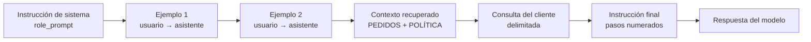

# Fase 3 · Aplicación de la ingeniería de prompts

**Caso:** optimización de la atención al cliente en EcoMarket
**Autores:** William Alberto Suaza · Anderson Trujillo · Bairon Gutiérrez

---

## 1. Qué construimos

Implementamos el asistente de atención al cliente de EcoMarket como una aplicación de línea de
comandos que recibe el mensaje de un cliente, recupera el contexto operativo de la empresa y
construye una cadena de prompts para obtener la respuesta del modelo.

El objetivo de esta fase no es la aplicación en sí, sino **hacer visible el efecto de la ingeniería
de prompts**. Por eso el proyecto incluye dos configuraciones de prompts sobre el mismo código y los
mismos datos:

| Configuración | Archivo                   | Qué representa                                                                                                                          |
| ------------- | ------------------------- | --------------------------------------------------------------------------------------------------------------------------------------- |
| Inicial       | `src/settings.toml`       | Prompt básico: una instrucción de una línea, sin rol, sin política de devoluciones y con el volcado completo de los pedidos             |
| Final         | `src/settings-final.toml` | Prompt trabajado: rol definido, recuperación selectiva, política en contexto, pasos numerados, ejemplos etiquetados y formato de salida |

Las respuestas reales de ambas configuraciones quedan guardadas en `outputs/basico` y
`outputs/mejorado`, de modo que la diferencia puede compararse sin volver a ejecutar el proyecto.

### Modelo utilizado

La Fase 1 propone GPT-4o mini para este tramo. Al no disponer de acceso comercial a esa API,
ejecutamos la implementación con **Gemini 3.6 Flash**.

## 2. Estructura del proyecto

```
taller-1/
├── generar_salidas.sh              Ejecuta las cinco consultas con ambas configuraciones
├── requirements.txt                Dependencias con versiones fijadas
├── .env.example                    Plantilla de la credencial
├── outputs/
│   ├── basico/                     Respuestas obtenidas con el prompt inicial
│   └── mejorado/                   Respuestas obtenidas con el prompt final
└── src/
    ├── app.py                      Ensamblado de la cadena de prompts y llamada al modelo
    ├── settings.toml               Configuración inicial
    ├── settings-final.toml         Configuración final
    └── datos/
        ├── pedidos.json            Doce pedidos que actúan como base de datos de prueba
        ├── politica-devoluciones.md  Política que determina qué se puede devolver
        └── consultas/              Cinco mensajes de cliente que cubren los escenarios
```

## 3. Cómo se ensambla la cadena de prompts

`app.py` no envía un único bloque de texto. Construye una secuencia de mensajes con roles
diferenciados, que el modelo interpreta como una conversación ya iniciada:



El paso de recuperación es el que conecta esta fase con la arquitectura de la Fase 1. Antes de
llamar al modelo, la aplicación:

1. Busca números de seguimiento en el mensaje del cliente con el patrón `ECO-AAAA-NNNN`.
2. Extrae de `pedidos.json` únicamente esos registros.
3. Si el número no existe, inserta en el contexto una declaración explícita de que **no existe**, en
   lugar de dejar el vacío que el modelo tendería a rellenar.
4. Añade la política de devoluciones como bloque delimitado.

## 4. Técnicas de ingeniería de prompts aplicadas

| Técnica                            | Dónde la aplicamos                                           | Qué problema resuelve                                                                                      |
| ---------------------------------- | ------------------------------------------------------------ | ---------------------------------------------------------------------------------------------------------- |
| Prompt de rol                      | `role_prompt` de la configuración final                      | Fija identidad, tono de marca y los límites que el asistente no debe cruzar                                |
| Delimitadores                      | `>>>>> INICIO PEDIDOS`, `>>>>> INICIO CONSULTA`, entre otros | Separa datos, mensaje del cliente e instrucciones, e impide que el texto del cliente se lea como una orden |
| Instrucciones en pasos numerados   | `instruction_prompt` de la configuración final               | Descompone una tarea con muchas condiciones en decisiones pequeñas y verificables                          |
| Inyección de contexto recuperado   | Bloques `PEDIDOS` y `POLITICA_DEVOLUCIONES`                  | Sustituye la memoria del modelo por el dato verificado de la empresa                                       |
| Recuperación selectiva             | Parámetro `recuperacion = "selectiva"`                       | Reduce el costo por consulta y evita exponer pedidos de otros clientes                                     |
| Ejemplos etiquetados con roles     | Bloques `[[prompts.ejemplos]]`                               | Muestra el formato y el tono esperados con turnos de usuario y de asistente, no como texto suelto          |
| Manejo explícito del caso negativo | Pasos 2 y 6 de la instrucción final                          | Enseña al modelo qué hacer cuando la respuesta correcta es "no puedo" o "no procede"                       |
| Formato de salida controlado       | Paso 10, línea `Clasificación:`                              | Produce una marca legible por máquina que el enrutador usa para derivar el caso                            |
| Temperatura en cero                | `temperatura = 0` en la configuración final                  | Hace las respuestas prácticamente deterministas y reproducibles                                            |

## 5. Documento de pedidos

El archivo `src/datos/pedidos.json` cumple el requisito de actuar como base de datos de prueba.
Contiene doce pedidos con estados deliberadamente variados para ejercitar todas las ramas de la
instrucción:

| Número de seguimiento | Estado              | Particularidad que ejercita                              |
| --------------------- | ------------------- | -------------------------------------------------------- |
| ECO-2026-1042         | Entregado           | Devolución procedente: textiles sin uso                  |
| ECO-2026-1087         | En tránsito         | Respuesta estándar con fecha estimada                    |
| ECO-2026-1113         | Retrasado           | Motivo de retraso y reprogramación                       |
| ECO-2026-1150         | En preparación      | Sin transportadora asignada todavía                      |
| ECO-2026-1187         | Retrasado           | Segunda reprogramación; exige disculpa y explicación     |
| ECO-2026-1204         | En tránsito         | Productos perecederos                                    |
| ECO-2026-1235         | Entregado           | Producto con falla: caso de escalamiento                 |
| ECO-2026-1268         | Devolución en curso | Devolución ya aprobada                                   |
| ECO-2026-1290         | Cancelado           | Reembolso ya aplicado                                    |
| ECO-2026-1317         | En preparación      | Envío programado a futuro                                |
| ECO-2026-1344         | En tránsito         | Pedido mixto                                             |
| ECO-2026-1372         | Entregado           | Pedido mixto: un producto devolvible y dos que no lo son |

La política de devoluciones vive en `src/datos/politica-devoluciones.md` e incluye plazos,
categorías que admiten devolución, categorías excluidas por razones sanitarias, excepciones
aplicables y las situaciones que obligan a derivar el caso a un agente humano.

## 6. Ejercicio 1 · Prompt de solicitud de pedido

**Consulta de prueba** (`src/datos/consultas/01-estado-pedido-retrasado.txt`):

> Hola, buenas tardes. Compré hace ya varios días y el pedido ECO-2026-1187 todavía no llega.
> ¿Me pueden decir qué está pasando y cuándo lo voy a recibir?

### Versión inicial

```toml
[general]
temperatura = 0.7
recuperacion = "completa"
incluir_politica = false

[prompts]
role_prompt = ""
instruction_prompt = """
Responde la consulta del cliente.
"""
```

La instrucción no dice quién responde, ni qué datos debe incluir, ni qué hacer si el pedido está
retrasado. Además entrega los doce pedidos completos en cada consulta, lo que multiplica el costo y
obliga al modelo a localizar el registro por su cuenta.

### Versión final

El prompt final actúa sobre cuatro palancas simultáneas:

1. **Rol:** el asistente se llama Iris, tutea, escribe en español neutro y tiene prohibido inventar.
2. **Contexto:** solo el pedido citado, más la política de devoluciones.
3. **Instrucción por pasos:** informar estado, transportadora, fecha estimada y enlace de rastreo; y
   cuando el estado sea `Retrasado`, ofrecer disculpa explícita, explicar el motivo registrado y
   señalar la nueva fecha.
4. **Formato:** máximo doscientas palabras y una línea final de clasificación.

Fragmento pertinente de `settings-final.toml`:

```toml
instruction_prompt = """
Atiende la consulta delimitada entre >>>>> INICIO CONSULTA y <<<<< FIN CONSULTA aplicando en
orden los siguientes pasos:

1. Localiza el número de seguimiento de la consulta dentro del bloque PEDIDOS.
2. Si el bloque PEDIDOS indica que ese número NO EXISTE, dilo con amabilidad, no describas ningún
   pedido, y pide al cliente que verifique el número en su correo de confirmación.
3. Si la consulta es sobre el estado de un pedido, informa: estado actual, transportadora, fecha
   estimada de entrega y el enlace de rastreo tal como aparece en el registro.
4. Si el estado es "Retrasado", ofrece una disculpa explícita, explica el motivo registrado en el
   campo correspondiente y señala la nueva fecha estimada.
...
"""
```

## 7. Ejercicio 2 · Prompt de devolución de producto

El desafío del enunciado consiste en que el asistente distinga los productos que pueden devolverse
de los que no, y que sea claro y empático incluso cuando la devolución no procede. Lo abordamos con
dos consultas complementarias sobre el mismo mecanismo.

**Caso procedente** (`03-devolucion-procedente.txt`): camisetas de algodón sin uso y con etiqueta,
del pedido `ECO-2026-1042`. La categoría Textiles admite devolución, de modo que la respuesta
esperada enumera los pasos del proceso y el plazo de reembolso.

**Caso mixto y mayormente improcedente** (`04-devolucion-no-procedente.txt`): del pedido
`ECO-2026-1372` el cliente quiere devolver café en grano, un desodorante ya destapado y una tote bag
sin usar. La respuesta correcta exige tres decisiones distintas en un solo mensaje:

| Producto                     | Categoría             | Resultado esperado                               |
| ---------------------------- | --------------------- | ------------------------------------------------ |
| Café de origen en grano      | Alimentos perecederos | No procede: inocuidad                            |
| Desodorante natural en barra | Higiene personal      | No procede: riesgo sanitario por empaque abierto |
| Tote bag de lona reciclada   | Textiles              | Sí procede: sin uso                              |

Los pasos 5, 6 y 7 de la instrucción final son los que producen este comportamiento: obligan a
clasificar **producto por producto** contra la política, a explicar el motivo sanitario sin culpar al
cliente y a ofrecer la excepción aplicable cuando el artículo llegó en mal estado. Los ejemplos
etiquetados refuerzan el patrón mostrando una respuesta que acepta un producto y rechaza otro dentro
del mismo mensaje.

## 8. Escenarios adicionales

Añadimos dos escenarios que no exige el enunciado pero que sustentan con evidencia los argumentos de
las fases anteriores.

**Pedido inexistente** (`02-estado-pedido-inexistente.txt`): el cliente pregunta por
`ECO-2026-9999`, que no está en la base. Es la prueba empírica del control de alucinaciones descrito
en la Fase 2: el contexto declara que el número no existe y el paso 2 de la instrucción prohíbe
describir cualquier pedido.

**Escalamiento a un agente humano** (`05-escalamiento-a-humano.txt`): un cliente molesto, con un
producto defectuoso, un cobro duplicado y una amenaza de reclamación formal. Es exactamente el tipo
de caso que la sección 6 de la política reserva a una persona. La respuesta esperada reconoce la
molestia, no promete soluciones y cierra con `Clasificación: REQUIERE_AGENTE_HUMANO`, que es la marca
que el enrutador usa para derivar el caso.

## 9. Ejecución

```bash
cd taller-1
python3 -m venv .venv
source .venv/bin/activate
pip install -r requirements.txt

cp .env.example .env      # escribe tu clave de Google AI Studio dentro de .env
```

Una consulta con la configuración inicial y con la final:

```bash
python src/app.py src/datos/consultas/01-estado-pedido-retrasado.txt \
  --configuracion src/settings.toml

python src/app.py src/datos/consultas/01-estado-pedido-retrasado.txt \
  --configuracion src/settings-final.toml
```

Las cinco consultas con ambas configuraciones, guardando las respuestas:

```bash
./generar_salidas.sh
```

## 10. Resultados observados

Ejecutamos las cinco consultas con las dos configuraciones sobre el mismo modelo y los mismos
datos. Lo único que cambia entre una columna y otra es el archivo de prompts. Las respuestas
completas están en `outputs/basico` y `outputs/mejorado`.

### Comparación global

| Aspecto verificado                          | Configuración inicial                                  | Configuración final                    |
| ------------------------------------------- | ------------------------------------------------------ | -------------------------------------- |
| Contexto enviado por consulta               | Los doce pedidos completos, con datos de doce clientes | Solo el pedido citado, más la política |
| Tamaño aproximado del contexto              | ≈ 2.700 tokens                                         | ≈ 1.300 tokens                         |
| Extensión media de la respuesta             | 193 palabras                                           | 129 palabras                           |
| Solicita datos personales adicionales       | Sí, incluido el documento de identidad                 | No                                     |
| Compromisos fuera de la política            | Sí, en dos de las cinco respuestas                     | No                                     |
| Deriva el caso sensible a un agente humano  | No                                                     | Sí                                     |
| Marca legible por máquina para el enrutador | Ausente                                                | Presente en las cinco respuestas       |
| Determinismo entre ejecuciones              | Temperatura 0,7                                        | Temperatura 0                          |

### Hallazgos por escenario

**Estado de pedido retrasado.** Ambas configuraciones aciertan: identifican el estado `Retrasado`,
el motivo registrado y la nueva fecha. Es el escenario donde la ingeniería de prompts menos aporta,
porque la tarea es casi de transcripción. La diferencia está en la forma: la versión inicial
devuelve una ficha técnica de 120 palabras con viñetas y códigos de guía, mientras que la final
entrega 88 palabras en un tono conversacional que incluye la disculpa exigida por el paso 4.

**Pedido inexistente.** Ninguna de las dos inventó un pedido, lo cual confirma que el control de
alucinaciones funciona. Pero la versión inicial introdujo un problema distinto: para "buscar
manualmente" el pedido, pidió al cliente su _"nombre completo, correo electrónico o
cédula/documento de identidad"_. Solicitar un documento de identidad para consultar un envío
contradice el principio de minimización de datos que sostenemos en la Fase 2. La versión final se
limita a pedir que el cliente verifique el número en su correo de confirmación, porque el prompt de
rol prohíbe expresamente solicitar datos sensibles.

**Devolución procedente.** La versión inicial ofreció al cliente un _"cambio de talla"_ que no
existe en la política de EcoMarket, y lo presentó como una opción disponible. Es exactamente el
riesgo que describimos como compromiso no autorizado: el modelo, sin la política en contexto,
completó el vacío con lo que suele ofrecer una tienda de ropa. La versión final se ciñe al
procedimiento real y cita los plazos del documento: guía prepagada sin costo, revisión en bodega de
hasta tres días hábiles y reembolso entre cinco y diez días hábiles.

**Devolución mixta.** Las dos configuraciones clasificaron correctamente los tres productos. La
diferencia no está en el resultado sino en su origen: la versión inicial no tenía la política en el
contexto y dedujo las reglas de su conocimiento general sobre comercio electrónico. Acertó, pero por
coincidencia, no por verificación; con una política propia menos convencional habría fallado sin
avisar. La versión final cita la categoría de cada producto y, además, ofrece la excepción prevista
para artículos averiados, que la versión inicial omitió por completo.

**Escalamiento a un agente humano.** Aquí la diferencia es decisiva. Frente a un cliente con un
producto defectuoso, un cobro duplicado y una amenaza de reclamación formal, la versión inicial
asumió el caso y prometió _"generar el reembolso total"_, _"enviarte una unidad totalmente nueva"_,
la _"reversión inmediata de los fondos"_ y el envío de comprobantes _"hoy mismo"_, y cerró con
_"Estaré al frente de tu caso de manera directa"_. Son compromisos que un asistente automatizado no
puede garantizar y que generan una expectativa que la empresa tendría que asumir. La versión final
reconoce la molestia, no promete ninguna solución, resume los tres puntos que traslada y cierra con
`Clasificación: REQUIERE_AGENTE_HUMANO`, que es la señal con la que el enrutador entrega el caso a
una persona.

### Lectura crítica de los resultados

El hallazgo más interesante es que la configuración inicial **no produce respuestas que parezcan
malas**. Están bien redactadas, son amables y en tres de los cinco escenarios llegan a una
conclusión correcta. Un lector desprevenido las aprobaría. El valor de la ingeniería de prompts no
consiste, entonces, en que la respuesta suene mejor, sino en convertir aciertos casuales en
garantías verificables: que la regla provenga de la política de la empresa y no del conocimiento
general del modelo, que no se pidan datos innecesarios, que no se prometa lo que no está autorizado,
que el caso sensible llegue a una persona y que la salida sea procesable por el sistema que enruta.

También reconocemos un límite de nuestra propia versión final: en dos respuestas el asistente saluda
al cliente por su nombre de pila, dato que proviene del registro recuperado. En este caso se trata
del titular del mismo pedido, de modo que no hay exposición de terceros, pero confirma que el
control de datos personales no puede descansar únicamente en el prompt. La anonimización previa que
proponemos en la arquitectura de la Fase 1 es la que debe retirar ese campo antes de construir el
contexto, y es la línea de trabajo siguiente sobre esta implementación.
