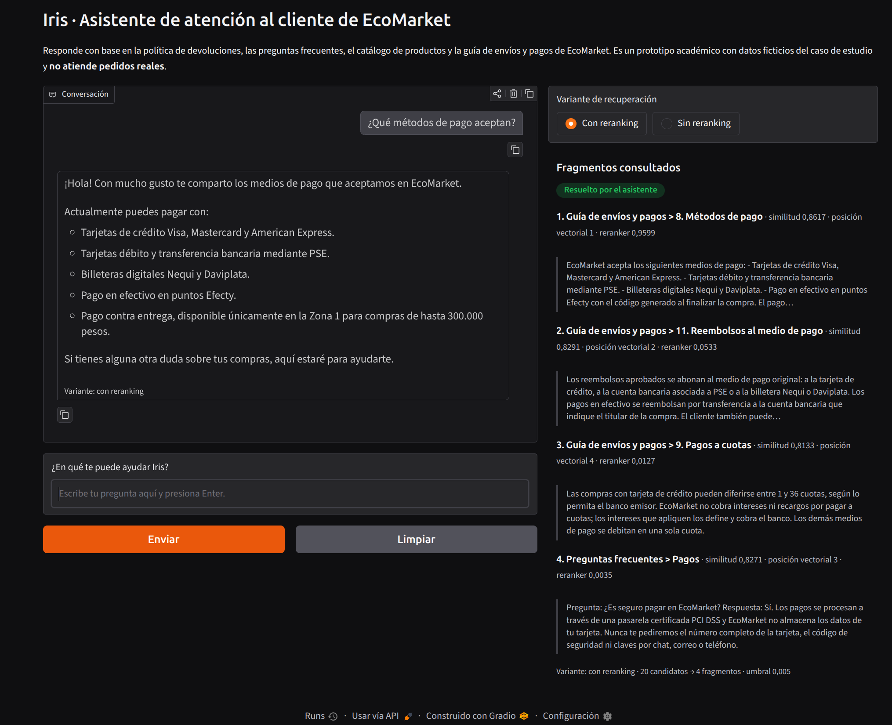

# Taller práctico 2 · Sistema RAG para la atención al cliente de EcoMarket

**Maestría en Inteligencia Artificial · Inteligencia Artificial Generativa**

**Autores:** William Alberto Suaza · Anderson Trujillo · Bairon Gutiérrez

---

## El caso

En el Taller 1 construimos a Iris, la asistente de atención al cliente de EcoMarket. Iris
respondía con exactitud dos tipos de consulta, el estado de un pedido y las devoluciones, porque
en cada llamada recibía el pedido citado y la política de devoluciones completa. Ahora EcoMarket
quiere que atienda **cualquier solicitud**. Cuando pueda, debe responder con información de la
empresa. Cuando no tenga con qué responder, debe decirlo con claridad.

Para lograrlo incorporamos un sistema de generación aumentada por recuperación (RAG). Iris consulta
una base de conocimiento con cuatro documentos de la empresa, recupera solo los fragmentos
pertinentes, los reordena con un modelo de reranking y redacta la respuesta a partir de ellos.

## Contenido de la entrega

| Fase | Documento                                                      | Qué contiene                                                                                                                                                               |
| ---- | -------------------------------------------------------------- | -------------------------------------------------------------------------------------------------------------------------------------------------------------------------- |
| 1    | [Selección de componentes](fase-1-seleccion-de-componentes.md) | Arquitectura del sistema, comparación y elección del modelo de embeddings, del reranker y de la base vectorial (Pinecone, ChromaDB, Weaviate) con criterios ponderados     |
| 2    | [Base de conocimiento](fase-2-base-de-conocimiento.md)         | Los cuatro documentos y por qué los pedidos no se vectorizan, comparación de estrategias de segmentación, estrategia elegida por tipo de documento, metadatos e indexación |
| 3    | [Integración y ejecución](fase-3-integracion-y-ejecucion.md)   | Recorrido del código por pasos del flujo RAG, cadena LCEL, ajustes respecto al Taller 1, experimento sin reranking frente a con reranking, limitaciones y suposiciones     |

## La solución en una frase

Los pedidos se siguen consultando por su número exacto, como en el Taller 1. El resto del
conocimiento de EcoMarket se recupera en dos etapas: un modelo de embeddings multilingüe trae 20
candidatos desde ChromaDB y un cross-encoder elige los cuatro que de verdad responden la consulta.
Si ninguno alcanza el umbral de relevancia, Iris reconoce que no tiene esa información.

## Cómo ejecutar el código

Requiere Python 3.11 o superior, unos 4 GB de espacio libre para los modelos abiertos que se
descargan en la primera ejecución y una clave de la API de Gemini obtenida en
[Google AI Studio](https://aistudio.google.com/apikey). No se necesita GPU.

```bash
cd taller-2
python3 -m venv .venv
source .venv/bin/activate
pip install torch==2.14.0 --index-url https://download.pytorch.org/whl/cpu
pip install -r requirements.txt
```

La primera instalación de `torch` usa el índice de ruedas solo para CPU, que pesa una fracción de la
versión con CUDA.

Configura la credencial copiando la plantilla y escribiendo la clave en `.env`, que está excluido del
control de versiones:

```bash
cp .env.example .env
```

Construye el índice vectorial. Este paso se ejecuta una vez y cada vez que cambie un documento de
`src/datos/`:

```bash
python src/indexar.py --listar
```

Genera la respuesta para una consulta, con o sin reranking:

```bash
python src/app.py src/datos/consultas/05-distractor-lexico.txt \
  --configuracion src/settings-reranking.toml

python src/app.py src/datos/consultas/05-distractor-lexico.txt \
  --configuracion src/settings-sin-reranking.toml
```

Ejecuta el experimento de recuperación. No llama a la API de Gemini:

```bash
python src/experimento.py
```

Abre la interfaz de chat para conversar con Iris y alternar entre la variante con reranking y la
variante sin reranking. Queda disponible en `http://127.0.0.1:7860`, solo en el propio equipo:

```bash
python src/interfaz.py
```

El funcionamiento del chat puede verse en este
[video de demostración](https://www.youtube.com/watch?v=yllORKz-tu8):

[](https://www.youtube.com/watch?v=yllORKz-tu8)



Ejecuta todo de principio a fin: el índice si no existe, las ocho consultas con ambas
configuraciones y el experimento:

```bash
./generar_salidas.sh
```

En un equipo sin GPU, el flujo completo tarda alrededor de media hora, porque el reranker procesa
20 candidatos por consulta en CPU. Hace 16 llamadas a la API de Gemini, dentro de la cuota gratuita
de `gemini-3.5-flash-lite`.

## Estructura del repositorio

```
taller-2/
├── README.md
├── fase-1-seleccion-de-componentes.md
├── fase-2-base-de-conocimiento.md
├── fase-3-integracion-y-ejecucion.md
├── generar_salidas.sh
├── requirements.txt
├── .env.example
├── imagenes/interfaz-chat.png       Captura de la interfaz de chat
├── outputs/
│   ├── indice/fragmentos.md         Los 75 fragmentos indexados
│   ├── sin-reranking/               Respuestas con la variante sin reranking
│   ├── reranking/                   Respuestas con la variante con reranking
│   └── experimento/                 Reporte y métricas del experimento
└── src/
    ├── rag.py                       Segmentación, embeddings, ChromaDB, reranking y cadena LCEL
    ├── indexar.py                   Construcción del índice vectorial
    ├── app.py                       Asistente de línea de comandos
    ├── interfaz.py                  Interfaz de chat con Gradio
    ├── experimento.py               Comparación sin reranking frente a con reranking
    ├── settings-sin-reranking.toml
    ├── settings-reranking.toml
    └── datos/
        ├── politica-devoluciones.md
        ├── faq.json
        ├── catalogo-productos.csv
        ├── guia-envios-y-pagos.pdf
        ├── pedidos.json
        ├── consultas/               Ocho mensajes de cliente para comparar respuestas
        └── evaluacion/              24 consultas etiquetadas para el experimento
```
