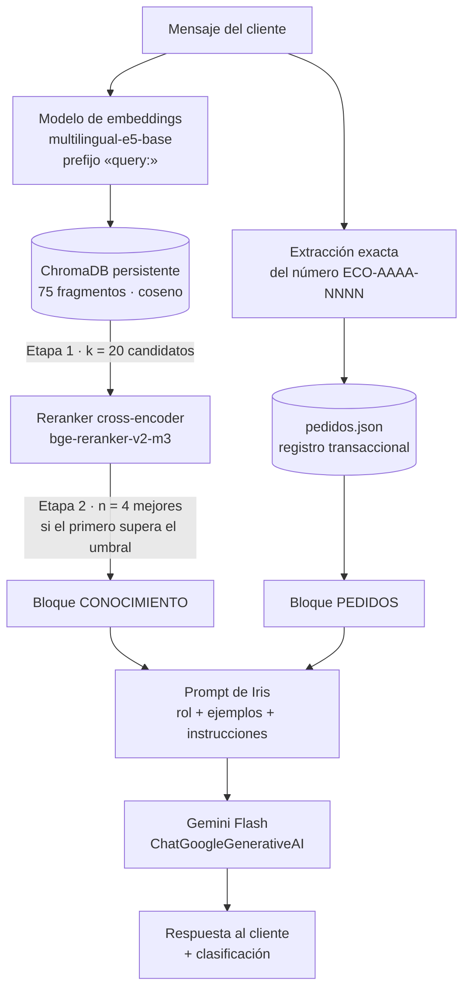

# Fase 1 · Selección de componentes clave del sistema RAG

**Caso:** optimización de la atención al cliente en EcoMarket con generación aumentada por
recuperación
**Autores:** William Alberto Suaza · Anderson Trujillo · Bairon Gutiérrez

---

## 1. Punto de partida

En el Taller 1 construimos a Iris, la asistente de EcoMarket, sobre Gemini 3.6 Flash. Su
exactitud dependía de que el contexto viajara completo en cada llamada: el pedido citado,
recuperado por su número de seguimiento, y la política de devoluciones entera. Con dos casos de uso
y un solo documento de cinco mil caracteres, esa estrategia funcionaba.

Para este taller queremos que el asistente atienda **cualquier tipo de solicitud**: productos del
catálogo, envíos, medios de pago, cuenta, programa de puntos, además de pedidos y devoluciones. Si
el asistente no tiene información para responder, debe decirlo. Ampliar el alcance con la
estrategia anterior nos obligaría a meter todos los documentos de la empresa en cada prompt, y eso
trae tres problemas:

| Problema de inyectar todo el contexto         | Consecuencia para EcoMarket                                                                                          |
| --------------------------------------------- | -------------------------------------------------------------------------------------------------------------------- |
| El prompt crece con cada documento nuevo      | El costo por consulta sube de forma lineal con el tamaño de la base documental, no con la dificultad del caso        |
| El modelo recibe mucho texto que no aplica    | Aumenta el riesgo de que mezcle reglas de temas vecinos (por ejemplo, devolución de productos y reembolso del envío) |
| No hay una señal de «esto no está en la base» | El modelo tiende a completar con conocimiento general, justo la alucinación que el Taller 1 buscaba evitar           |

Un sistema RAG resuelve estos tres puntos: guarda la base documental en un índice consultable, le
entrega al modelo solo los fragmentos pertinentes para cada consulta y, al medir la relevancia de lo
recuperado, puede detectar cuándo la base no tiene respuesta.

## 2. Arquitectura del sistema

La arquitectura conserva la decisión central del Taller 1: **los datos transaccionales no se
buscan por similitud**. Los pedidos se siguen recuperando por coincidencia exacta del número
`ECO-AAAA-NNNN`, y el RAG se encarga del conocimiento documental.

Hay cuatro componentes nuevos que elegir: el modelo de embeddings, la base de datos vectorial, el
modelo de reranking y el framework que los conecta. El modelo generativo se mantiene.

## 3. Modelo de embeddings

### 3.1 Qué exigimos del modelo

El modelo de embeddings convierte cada fragmento y cada consulta en un vector, y la recuperación
depende por completo de que los textos que significan lo mismo queden cerca en ese espacio. Si el
fragmento correcto no llega a los candidatos de la primera etapa, ningún componente posterior puede
recuperarlo. Por eso le asignamos al desempeño en español el mayor peso.

| Criterio                        | Peso | Qué medimos                                                                                                              |
| ------------------------------- | ---- | ------------------------------------------------------------------------------------------------------------------------ |
| Desempeño en español            | 30%  | Calidad de recuperación con consultas coloquiales, regionalismos colombianos y paráfrasis de lo que dicen los documentos |
| Costo                           | 20%  | Costo de indexar la base y de vectorizar cada consulta, más el costo de reindexar cuando cambian los documentos          |
| Privacidad y dependencia        | 15%  | Si los textos de los clientes salen hacia un proveedor adicional y si cambiar de proveedor obliga a reindexar todo       |
| Latencia en CPU                 | 15%  | Tiempo para vectorizar una consulta sin GPU, que es el hardware del que disponemos                                       |
| Longitud de entrada y dimensión | 10%  | Que el límite de tokens cubra holgadamente nuestros fragmentos y que la dimensión no encarezca el almacenamiento         |
| Integración con LangChain       | 10%  | Disponibilidad de un conector mantenido y soporte para los prefijos o instrucciones que el modelo requiera               |

### 3.2 Alternativas evaluadas

| Modelo                                  | Tipo                 | Tamaño y dimensión           | Español                                                                     | Costo                                                                | Privacidad                        | Latencia en CPU   | Veredicto                                                                              |
| --------------------------------------- | -------------------- | ---------------------------- | --------------------------------------------------------------------------- | -------------------------------------------------------------------- | --------------------------------- | ----------------- | -------------------------------------------------------------------------------------- |
| `all-MiniLM-L6-v2`                      | Abierto              | 22 M · 384                   | Bajo: entrenado casi solo en inglés                                         | Nulo                                                                 | Local                             | Muy baja          | Referencia sólida y liviana para inglés; para español preferimos un modelo multilingüe |
| `paraphrase-multilingual-MiniLM-L12-v2` | Abierto, multilingüe | 118 M · 384                  | Medio: pensado para similitud de oraciones, no para recuperación de pasajes | Nulo                                                                 | Local                             | Muy baja          | Descartado: su entrenamiento no se ajusta a la relación pregunta–pasaje                |
| `intfloat/multilingual-e5-small`        | Abierto, multilingüe | 118 M · 384                  | Bueno                                                                       | Nulo                                                                 | Local                             | Muy baja          | Alternativa válida si la latencia fuera crítica                                        |
| **`intfloat/multilingual-e5-base`**     | Abierto, multilingüe | 278 M · 768 · 512 tokens     | **Bueno: entrenado con pares consulta–pasaje en más de 100 idiomas**        | **Nulo**                                                             | **Local**                         | **Baja**          | **Seleccionado**                                                                       |
| `BAAI/bge-m3`                           | Abierto, multilingüe | 568 M · 1.024 · 8.192 tokens | Muy bueno                                                                   | Nulo, pero exige más memoria                                         | Local                             | Media             | Sobredimensionado para fragmentos de menos de 1.000 caracteres                         |
| `text-embedding-3-small` (OpenAI)       | Propietario          | No publicado · 1.536         | Muy bueno                                                                   | Bajo por token, pero se paga en cada consulta y en cada reindexación | Los textos salen a otro proveedor | Depende de la red | Descartado: agrega un tercer proveedor y ata el índice a su API                        |
| `gemini-embedding-001` (Google)         | Propietario          | No publicado · 3.072         | Muy bueno                                                                   | Se paga por token y consume la misma cuota que el modelo generativo  | Mismo proveedor que el LLM        | Depende de la red | Descartado: vectores muy grandes y cuota compartida con la generación                  |

Aplicamos los pesos de la sección 3.1: puntuamos cada alternativa de 1 a 5 en cada criterio y
calculamos el promedio ponderado.

| Modelo                                  | Español (30%) | Costo (20%) | Privacidad (15%) | Latencia (15%) | Entrada y dimensión (10%) | Integración (10%) | **Total** |
| --------------------------------------- | ------------- | ----------- | ---------------- | -------------- | ------------------------- | ----------------- | --------- |
| **`intfloat/multilingual-e5-base`**     | 4             | 5           | 5                | 4              | 5                         | 5                 | **4,55**  |
| `BAAI/bge-m3`                           | 5             | 4           | 5                | 3              | 4                         | 5                 | 4,40      |
| `intfloat/multilingual-e5-small`        | 3             | 5           | 5                | 5              | 4                         | 5                 | 4,30      |
| `paraphrase-multilingual-MiniLM-L12-v2` | 2             | 5           | 5                | 5              | 3                         | 5                 | 3,90      |
| `text-embedding-3-small` (OpenAI)       | 5             | 3           | 2                | 3              | 4                         | 5                 | 3,75      |
| `all-MiniLM-L6-v2`                      | 1             | 5           | 5                | 5              | 3                         | 5                 | 3,60      |
| `gemini-embedding-001` (Google)         | 5             | 2           | 3                | 3              | 2                         | 5                 | 3,50      |

Las tres opciones abiertas y multilingües quedan a menos de 0,3 puntos entre sí, así que la
decisión es sensible a los pesos. Con GPU, la latencia dejaría de penalizar a `bge-m3`: ambos
modelos empatarían en 4,70, y la mejor calidad en español de `bge-m3` inclinaría la decisión a su
favor. Los modelos propietarios pierden por costo y privacidad, no por calidad. Los modelos
centrados en inglés no compensan con velocidad su bajo desempeño en español, que es el criterio de
mayor peso.

### 3.3 Justificación

**Desempeño en español.** La familia E5 multilingüe se entrenó específicamente para recuperación:
aprendió a acercar una pregunta al pasaje que la responde, no solo dos oraciones parecidas. Esa es
exactamente la tarea de EcoMarket, donde el cliente escribe «se me olvidó la clave» y el documento
dice «¿Cómo recupero mi contraseña?». El modelo exige anteponer `query:` a las consultas y
`passage:` a los fragmentos; lo configuramos así en `HuggingFaceEmbeddings` y normalizamos los
vectores para que la distancia de coseno sea directamente comparable.

**Costo.** El modelo corre localmente. Indexar los 75 fragmentos de la base toma alrededor de
treinta segundos en CPU, y reindexar cuando cambia un documento no genera ningún costo por token.
Con un modelo propietario, cada cambio en el catálogo implicaría pagar de nuevo la vectorización.

**Escalabilidad.** El costo de indexar crece de forma lineal con el número de fragmentos. A la
velocidad medida, unos cinco mil fragmentos se indexan en menos de media hora en CPU, y la
indexación es un proceso por lotes que no afecta la atención. Vectorizar la consulta cuesta lo
mismo sin importar el tamaño de la base: lo que crece con la base es la búsqueda, que resuelve la
base vectorial (sección 5).

**Privacidad y dependencia.** Los mensajes de los clientes contienen nombres, ciudades y detalles
de sus compras. El riesgo de privacidad que analizamos en la Fase 2 del Taller 1 crece con cada
proveedor que recibe esos textos. Con embeddings locales, la consulta solo sale hacia el proveedor
del modelo generativo, que ya la recibía. Además, un índice construido con un modelo propio no
queda atado a la API de un tercero: si un proveedor cambia precios o descontinúa un modelo, no hay
que reindexar.

**Latencia y dimensión.** Con 278 millones de parámetros, el modelo vectoriza la consulta y
Chroma devuelve los 20 candidatos en menos de un tercio de segundo en CPU: entre 76 y 288 ms de
media en nuestras ejecuciones del experimento de la Fase 3. Sus 768 dimensiones son la mitad de las de
`text-embedding-3-small` y una cuarta parte de las de `gemini-embedding-001`, lo que reduce el
almacenamiento y el tiempo de
búsqueda. El límite de 512 tokens cubre de sobra nuestros fragmentos, que no superan los 1.000
caracteres.

**Por qué no el modelo más grande.** `bge-m3` rinde algo mejor en las evaluaciones multilingües
públicas, pero su principal ventaja es la ventana de 8.192 tokens, que no aprovechamos porque
fragmentamos en unidades cortas. Preferimos un modelo mediano y confiar la precisión fina a la
segunda etapa de reranking.

## 4. Modelo de reranking

### 4.1 Por qué dos etapas

El modelo de embeddings es un _bi-encoder_: vectoriza la consulta y cada fragmento **por
separado**, y luego compara los vectores. Esto es muy rápido, porque los fragmentos se vectorizan
una sola vez al indexar, pero el modelo nunca ve la consulta y el fragmento juntos. Por eso confunde
textos que comparten vocabulario pero responden preguntas distintas. En EcoMarket esto pasa, por
ejemplo, con «devolver la caja del pedido» (un programa de reciclaje) y «devolver un producto» (la
política de devoluciones).

Un _cross-encoder_ recibe la consulta y el fragmento concatenados y estima directamente qué tan
bien el fragmento responde la consulta. Es mucho más preciso, pero también mucho más costoso: no
puede precalcularse y debe ejecutarse para cada par. La solución estándar combina ambos: el
bi-encoder filtra la base completa hasta 20 candidatos y el cross-encoder reordena solo esos 20.

### 4.2 Alternativas evaluadas

| Modelo                                       | Tipo                 | Español                   | Costo                   | Latencia en CPU con 20 candidatos                                            | Veredicto                                                                              |
| -------------------------------------------- | -------------------- | ------------------------- | ----------------------- | ---------------------------------------------------------------------------- | -------------------------------------------------------------------------------------- |
| `cross-encoder/ms-marco-MiniLM-L-6-v2`       | Abierto              | Bajo: entrenado en inglés | Nulo                    | Muy baja                                                                     | Referencia rápida y probada para inglés; para español preferimos un modelo multilingüe |
| `cross-encoder/mmarco-mMiniLMv2-L12-H384-v1` | Abierto, multilingüe | Bueno                     | Nulo                    | Baja: unas ocho veces menor que la de `bge-reranker-v2-m3` en nuestra prueba | Alternativa si la latencia fuera crítica                                               |
| **`BAAI/bge-reranker-v2-m3`**                | Abierto, multilingüe | **Muy bueno**             | **Nulo**                | Alta: entre 20 y 36 s medidos                                                | **Seleccionado**                                                                       |
| Cohere Rerank multilingüe                    | Propietario, API     | Muy bueno                 | Pago por búsqueda       | Depende de la red                                                            | Descartado: otra clave, otro proveedor y otro costo por consulta                       |
| Gemini como reranker                         | Propietario, LLM     | Muy bueno                 | Alto: una llamada extra | Alta                                                                         | Descartado: lento, costoso y sin puntajes estables                                     |

`bge-reranker-v2-m3` parte de la misma base multilingüe que `bge-m3` y está afinado para ordenar
pasajes por relevancia. Su salida pasa por una sigmoide, así que cada par recibe un puntaje entre
0 y 1. Ese puntaje nos da algo que el bi-encoder no ofrece: una señal para decidir cuándo **ningún**
fragmento responde la consulta. Con ella implementamos el umbral de relevancia que activa la
respuesta «no cuento con esa información» y la clasificación `SIN_INFORMACION_DISPONIBLE`.

El costo es la latencia. El modelo tiene 568 millones de parámetros y, en nuestro equipo sin GPU,
procesar los 20 pares le añade entre 20 y 36 segundos a cada consulta, pero la ganancia de precisión compensa ese
costo y lo otro es que la latencia es un problema de hardware con soluciones conocidas: una GPU modesta reduce este tiempo en más de un orden de magnitud, y el reranker liviano de la tabla queda disponible con solo cambiar
`modelo_reranker` en la configuración y recalibrar el umbral. Aun en CPU, con los modelos ya
cargados en memoria, la respuesta completa tarda menos de un minuto, frente a las veinticuatro
horas que el caso describe como tiempo actual.

## 5. Base de datos vectorial

### 5.1 Criterios

| Criterio                     | Peso | Qué medimos                                                                                       |
| ---------------------------- | ---- | ------------------------------------------------------------------------------------------------- |
| Costo                        | 25%  | Costo mensual al volumen actual de EcoMarket y al volumen proyectado                              |
| Facilidad de uso y operación | 25%  | Esfuerzo para instalar, ejecutar, respaldar y mantener; EcoMarket aún no tiene un equipo de MLOps |
| Escalabilidad                | 20%  | Comportamiento ante millones de vectores y alta concurrencia                                      |
| Filtrado por metadatos       | 15%  | Capacidad de restringir la búsqueda por tipo de documento, categoría o vigencia                   |
| Búsqueda híbrida             | 15%  | Combinación nativa de búsqueda por palabras clave (BM25) y por vectores                           |

### 5.2 Comparación

| Opción             | Modelo de despliegue                                              | Costo                                                          | Facilidad                                                  | Escalabilidad                                                 | Metadatos     | Híbrida                 | Ventaja principal para EcoMarket                              | Desventaja principal para EcoMarket                                                               |
| ------------------ | ----------------------------------------------------------------- | -------------------------------------------------------------- | ---------------------------------------------------------- | ------------------------------------------------------------- | ------------- | ----------------------- | ------------------------------------------------------------- | ------------------------------------------------------------------------------------------------- |
| **ChromaDB**       | Librería embebida, servidor propio o nube                         | **Nulo en modo embebido**                                      | **Muy alta: `pip install` y un directorio en disco**       | Buena en un nodo; limitada para alta concurrencia distribuida | Sí            | No nativa               | Se ejecuta en cualquier equipo sin cuentas ni infraestructura | No está pensada para varias réplicas atendiendo miles de consultas simultáneas                    |
| Pinecone           | Servicio gestionado _serverless_                                  | Gratuito limitado; luego pago por almacenamiento y operaciones | Alta: sin servidores que operar, pero exige cuenta y clave | Muy alta y automática                                         | Sí            | Sí (vectores dispersos) | Escala sin que EcoMarket opere infraestructura                | Dependencia de un proveedor, datos fuera de la empresa y costo recurrente                         |
| Weaviate           | Código abierto autoalojado (Docker, Kubernetes) o nube gestionada | Nulo autoalojado más infraestructura; pago en su nube          | Media: requiere contenedores y configurar esquemas         | Muy alta, con réplicas y _sharding_                           | Sí, con tipos | **Sí, nativa**          | Búsqueda híbrida BM25 + vectores sin componentes adicionales  | Curva de operación que hoy EcoMarket no puede asumir                                              |
| FAISS (referencia) | Librería de índices                                               | Nulo                                                           | Alta para prototipos                                       | Muy alta en búsqueda pura                                     | No            | No                      | Rendimiento de búsqueda y simplicidad para prototipos         | Es una librería de índices: guardar textos y metadatos, y filtrar, queda a cargo de la aplicación |

Con los pesos de la sección 5.1:

| Opción             | Costo (25%) | Facilidad (25%) | Escalabilidad (20%) | Metadatos (15%) | Híbrida (15%) | **Total** |
| ------------------ | ----------- | --------------- | ------------------- | --------------- | ------------- | --------- |
| **ChromaDB**       | 5           | 5               | 3                   | 4               | 2             | **4,00**  |
| Pinecone           | 3           | 4               | 5                   | 4               | 4             | 3,95      |
| Weaviate           | 3           | 2               | 5                   | 5               | 5             | 3,75      |
| FAISS (referencia) | 5           | 4               | 4                   | 1               | 1             | 3,35      |

La diferencia entre ChromaDB y Pinecone es mínima: si el peso de la
escalabilidad subiera por encima del de la facilidad de uso, Pinecone quedaría primero. Ese es
justamente el cambio de prioridades que esperamos cuando el sistema pase a producción, y por eso la
sección 5.4 define cuándo migrar.

### 5.3 Decisión: ChromaDB persistente

Elegimos **ChromaDB en modo persistente**, con la colección guardada en `src/indice/` y distancia
de coseno. Estas son las razones:

- **Volumen real de EcoMarket.** La base de conocimiento está formada por políticas, preguntas
  frecuentes, la guía de envíos y pagos y el catálogo. Aun con miles de productos, son del orden de
  decenas de miles de vectores, un volumen que ChromaDB maneja en un solo nodo con latencias de
  milisegundos. Los millones de vectores que justificarían Pinecone o Weaviate corresponderían a
  otro tipo de uso, como indexar el histórico completo de conversaciones.
- **Metadatos.** Cada fragmento guarda su identificador, su fuente, su tipo y su sección. Con eso
  mostramos en cada respuesta qué se recuperó y medimos el experimento por
  identificador.
- **Persistencia.** En vez de crear la colección en memoria en cada
  ejecución, el índice se construye una vez con `indexar.py` y se reutiliza en cada consulta. Así
  evitamos recalcular los embeddings en cada ejecución.

### 5.4 Ruta de escalamiento

LangChain expone todas estas bases con la misma interfaz `VectorStore`, así que migrar solo
requiere reemplazar la clase en `abrir_almacen()` y reindexar. No hay que tocar la cadena ni los
prompts. Definimos dos disparadores concretos para migrar:

1. **Varias instancias del asistente atendiendo en paralelo.** Pasaríamos a ChromaDB en modo
   servidor o a Pinecone, según EcoMarket prefiera operar o delegar la infraestructura.
2. **Consultas con códigos exactos que la búsqueda semántica no resuelve bien**, como SKU o
   referencias. Pasaríamos a Weaviate por su búsqueda híbrida nativa.

## 6. Modelo generativo y framework

**Modelo generativo.** Mantenemos la familia **Gemini Flash** del Taller 1 y el mismo rol de Iris,
para que cualquier cambio en las respuestas se explique por la recuperación y no por un cambio de
proveedor. El Taller 1 se ejecutó con `gemini-3.6-flash`. Para este taller usamos
`gemini-3.5-flash-lite`, porque el nivel gratuito de `gemini-3.6-flash` permite 20 solicitudes
diarias por proyecto, y el conjunto de pruebas exige 16 respuestas por ejecución más las pruebas
de desarrollo. Las dos variantes del experimento usan el mismo modelo. La
configuración conserva la temperatura 0 del Taller 1. El rol solo
se amplió para que Iris se apoye en el nuevo bloque CONOCIMIENTO y disponga de una tercera
clasificación, `SIN_INFORMACION_DISPONIBLE`.

**Framework.** Usamos **LangChain** en su forma moderna, con cadenas LCEL. LCEL permite expresar el flujo
como una composición explícita de pasos: recuperar, rerankear, formatear, construir el prompt, llamar al modelo y leer el texto. El reranking queda como un eslabón visible y configurable, no como un detalle oculto en un componente
genérico. Integramos Gemini mediante `ChatGoogleGenerativeAI`.

## 7. Síntesis de la decisión

| Componente        | Elección                                                    | Razón principal                                                                          | Cómo impacta la eficacia del RAG                                                                        |
| ----------------- | ----------------------------------------------------------- | ---------------------------------------------------------------------------------------- | ------------------------------------------------------------------------------------------------------- |
| Embeddings        | `intfloat/multilingual-e5-base`                             | Entrenado para recuperación consulta–pasaje en español, local y sin costo por token      | Define el techo de la recuperación: lo que no llega a los 20 candidatos no se puede recuperar después   |
| Base vectorial    | ChromaDB persistente, distancia de coseno                   | Costo nulo, ejecución inmediata, metadatos y volumen adecuado a EcoMarket                | Determina la velocidad de la primera etapa y la trazabilidad de cada fragmento                          |
| Reranker          | `BAAI/bge-reranker-v2-m3`                                   | Mayor precisión multilingüe entre las opciones abiertas y puntaje utilizable como umbral | Decide qué cuatro fragmentos ve el modelo y en qué orden, y permite abstenerse cuando nada es relevante |
| Datos de pedidos  | Búsqueda exacta por número de seguimiento                   | Continuidad con el Taller 1: el dato transaccional no se aproxima                        | Garantiza que el pedido entregado al modelo sea el que el cliente citó                                  |
| Modelo generativo | `gemini-3.5-flash-lite` (familia Gemini Flash del Taller 1) | Continuidad con el Taller 1 dentro de la cuota gratuita                                  | Redacta a partir del contexto; su calidad depende de que el contexto sea el correcto                    |
| Framework         | LangChain con LCEL                                          | Cadena explícita y componentes intercambiables                                           | Permite alternar la variante sin reranking y la variante con reranking solo cambiando la configuración  |
