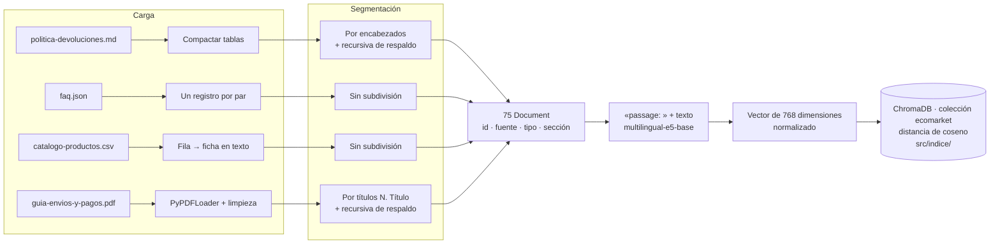

# Fase 2 · Creación de la base de conocimiento

**Caso:** optimización de la atención al cliente en EcoMarket con generación aumentada por
recuperación
**Autores:** William Alberto Suaza · Anderson Trujillo · Bairon Gutiérrez

---

## 1. Por qué esta fase decide el resultado

El modelo generativo solo puede ser tan preciso como el contexto que recibe. Si el fragmento
recuperado mezcla dos temas, si una tabla quedó separada de su encabezado o si el documento
contradice a otro, ni el mejor reranker ni el mejor prompt corrigen el error: Iris lo transmitirá
al cliente con total seguridad. Por eso tratamos la base de conocimiento como un producto con tres
exigencias: documentos correctos y coherentes entre sí, fragmentos que respeten las unidades de
sentido y un índice reproducible.

## 2. Documentos de la base de conocimiento

Identificamos cuatro fuentes documentales que, juntas, cubren las consultas que el caso describe
como repetitivas. Elegimos a propósito cuatro formatos distintos, porque en EcoMarket la
información vive en formatos distintos y cada uno exige un tratamiento propio.

| Documento                                                      | Formato               | Contenido                                                                                                                                                                                                 | Preguntas que resuelve                                                                     | Actualización esperada                         |
| -------------------------------------------------------------- | --------------------- | --------------------------------------------------------------------------------------------------------------------------------------------------------------------------------------------------------- | ------------------------------------------------------------------------------------------ | ---------------------------------------------- |
| [Política de devoluciones](src/datos/politica-devoluciones.md) | Markdown              | Versión 4.2 del Taller 1: plazos, categorías retornables y no retornables, excepciones, proceso y casos de derivación humana                                                                              | ¿Puedo devolver esto?, ¿cuánto tarda el reembolso?, ¿qué hago si llegó dañado?             | Por versión, pocas veces al año                |
| [Preguntas frecuentes](src/datos/faq.json)                     | JSON                  | 22 pares pregunta–respuesta sobre cuenta, privacidad, pedidos, productos, puntos Semilla, cupones, sostenibilidad y atención                                                                              | ¿Cómo recupero mi contraseña?, ¿cómo funcionan los puntos?, ¿tienen tienda física?         | Continua, a medida que surgen preguntas nuevas |
| [Catálogo de productos](src/datos/catalogo-productos.csv)      | CSV (hoja de cálculo) | 32 productos con SKU, categoría, descripción, precio, disponibilidad, material, origen, certificación, condición de devolución y garantía                                                                 | ¿Qué tienen para…?, ¿cuánto cuesta…?, ¿está disponible?, ¿tiene garantía?                  | Diaria: precios y disponibilidad cambian       |
| [Guía de envíos y pagos](src/datos/guia-envios-y-pagos.pdf)    | PDF                   | Versión 3.1, doce secciones: zonas de entrega, transportadoras, tiempos, costos, retrasos, reembolso del envío, cambios de dirección, medios de pago, cuotas, cobros duplicados, reembolsos y facturación | ¿Envían a mi ciudad?, ¿cuánto vale el envío?, ¿puedo pagar con Nequi?, ¿me cobraron doble? | Por versión, cuando cambian tarifas o aliados  |

Además, el sistema consulta un quinto origen de datos, el [registro de pedidos](src/datos/pedidos.json)
del Taller 1, que deliberadamente **no forma parte del índice vectorial**.

### 2.1 Por qué los pedidos no se vectorizan

| Razón                   | Explicación                                                                                                                                                                                                                                       |
| ----------------------- | ------------------------------------------------------------------------------------------------------------------------------------------------------------------------------------------------------------------------------------------------- |
| Identificadores exactos | Para un modelo de embeddings, `ECO-2026-1187` y `ECO-2026-1178` son casi el mismo texto. La búsqueda por similitud podría devolver el pedido de otro cliente, un error que para EcoMarket es más grave que no responder.                          |
| Volatilidad             | El estado de un pedido cambia varias veces al día. Vectorizarlo obligaría a reindexar cada cambio, y entre dos reindexaciones el índice mostraría estados desactualizados.                                                                        |
| Privacidad              | Un fragmento con el pedido de un cliente podría aparecer entre los candidatos de la consulta de otro. La búsqueda exacta solo devuelve el pedido que el cliente citó.                                                                             |
| Naturaleza del problema | Encontrar un pedido por su número es una consulta determinista que un diccionario resuelve sin error. La búsqueda semántica aporta valor cuando la pregunta y el documento usan palabras distintas, no cuando el cliente escribe la clave exacta. |

Esta separación continúa lo que el Taller 1 ya había establecido: el modelo redacta y los sistemas
de EcoMarket aportan el dato.

### 2.2 Calidad y coherencia de los documentos

Antes de fragmentar revisamos que las fuentes no se contradijeran, porque un RAG con dos
documentos en desacuerdo produce respuestas que dependen de cuál se recuperó primero.

- **Catálogo y pedidos.** Los 14 SKU que aparecen en `pedidos.json` están en el catálogo con el
  mismo nombre y la misma categoría.
- **Catálogo y política.** Las categorías del catálogo son exactamente las de la política. La
  columna `admite_devolucion` resume la regla de la política y remite a sus excepciones, sin
  contradecirla.
- **Guía y política.** Los plazos de reembolso, la gratuidad del transporte de retorno y la
  derivación a humano de los cobros duplicados son coherentes en ambos documentos.
- **Respuestas autocontenidas.** Cada respuesta de las preguntas frecuentes se entiende sin leer
  las demás. Cada una se convierte en un fragmento independiente, así que una respuesta del tipo
  «ver la pregunta anterior» quedaría vacía de contenido al recuperarse.
- **Distractores reales.** Mantuvimos situaciones que en cualquier comercio electrónico se prestan
  a confusión, porque son las que ponen a prueba la recuperación. Por ejemplo, «Devuelve tu caja»,
  un programa de reciclaje de empaques, no tiene relación con la devolución de productos; y el
  reembolso del costo del envío es distinto del reembolso del producto.

## 3. Estrategias de segmentación

La segmentación define qué unidad de texto se vectoriza, se recupera y llega al modelo. Evaluamos
cuatro estrategias frente a nuestros documentos:

| Estrategia   | Cómo divide                                                                                                    | Ventajas                                                                     | Desventajas en nuestros documentos                                                                                             |
| ------------ | -------------------------------------------------------------------------------------------------------------- | ---------------------------------------------------------------------------- | ------------------------------------------------------------------------------------------------------------------------------ |
| Tamaño fijo  | Cortes cada N caracteres o tokens, con o sin solapamiento                                                      | Simple, predecible y adecuado para texto corrido homogéneo, como un artículo | En tablas, filas del catálogo y pares pregunta–respuesta, el corte puede caer en la mitad de una unidad de sentido             |
| Por párrafos | Cortes en líneas en blanco                                                                                     | Respeta la unidad mínima de redacción                                        | Los párrafos varían entre una línea y media página; en el PDF extraído las líneas en blanco no se conservan de forma confiable |
| Recursiva    | Intenta cortar primero por párrafo, luego por línea, luego por oración, hasta que cada trozo cabe en el tamaño | Adaptable, buen comportamiento general.                                      | Sin separadores adaptados, agrupa temas vecinos si caben en el mismo tamaño y no sabe dónde empieza una sección                |
| Estructural  | Usa la estructura propia del documento: encabezados, registros, filas                                          | Cada fragmento es una unidad de sentido completa y rotulable                 | Requiere un divisor distinto por tipo de documento                                                                             |

### 3.1 Qué sale mal con una estrategia única

Para dimensionar el problema, aplicamos a nuestros documentos un divisor recursivo genérico, con una
configuración habitual de 1.000 caracteres y 200 de solapamiento, de forma uniforme:

- **Política de devoluciones.** Produce 8 fragmentos, y seis de ellos abarcan dos secciones. En
  tres, el fragmento arrastra contenido de la sección vecina. El fragmento con la tabla de
  «Categorías que admiten devolución» termina con el título «3. Categorías que NO admiten
  devolución» y su frase de introducción, mientras que la tabla correspondiente queda en el
  fragmento siguiente. Ante la pregunta «¿puedo devolver un desodorante?», el primer fragmento
  anuncia una lista de productos no retornables que no contiene. Lo mismo ocurre entre el proceso
  de devolución y los casos de derivación humana, y entre la presentación y los plazos generales.
  En los otros tres, el fragmento termina con el título de la sección siguiente sin su contenido,
  como las excepciones de la sección 4, que cierran con «5. Proceso de devolución».
- **Catálogo.** Un CSV cortado cada 1.000 caracteres deja la mitad de una fila en un fragmento y la
  otra mitad en el siguiente. El precio de un producto podría quedar junto al nombre del siguiente.
- **Preguntas frecuentes.** Aplicado al texto de los 22 pares pregunta–respuesta, produce 8
  fragmentos de dos o tres pares cada uno. Aplicado al JSON sin transformar, produce 11 y además
  vectoriza llaves, comillas y nombres de campo.
  Una consulta sobre puntos Semilla recuperaría también la respuesta sobre cupones, y la similitud
  del fragmento se diluiría entre temas distintos.
- **Guía en PDF.** Fragmentar el PDF página por página parte la sección «4. Costos de envío»: la
  frase de introducción termina en la página 1 y la lista de tarifas por zona empieza en la
  página 2. El fragmento con las tarifas no diría a qué se refieren.

### 3.2 Estrategia elegida: estructural por tipo, con recursiva como respaldo

| Documento                | Unidad de fragmento       | Implementación                                                                                                                                                                             | Resultado     |
| ------------------------ | ------------------------- | ------------------------------------------------------------------------------------------------------------------------------------------------------------------------------------------ | ------------- |
| Política de devoluciones | Una sección de nivel `##` | `MarkdownHeaderTextSplitter` por `#` y `##`; si una sección superara 800 caracteres, `RecursiveCharacterTextSplitter` la subdivide con 120 de solapamiento                                 | 8 fragmentos  |
| Preguntas frecuentes     | Un par pregunta–respuesta | Un `Document` por registro del JSON, sin subdivisión                                                                                                                                       | 22 fragmentos |
| Catálogo                 | Un producto (una fila)    | Cada fila se reescribe como ficha en texto natural («Producto:…», «Precio: $49.000 COP», «Admite devolución:…»)                                                                            | 32 fragmentos |
| Guía de envíos y pagos   | Una sección numerada      | `PyPDFLoader`; se unen las páginas, se limpia el texto, se corta antes de cada título `N. Título` y, si una sección superara 800 caracteres, `RecursiveCharacterTextSplitter` la subdivide | 13 fragmentos |

En total, la base queda en **75 fragmentos**. El volcado completo de cada fragmento, con su
identificador y su tamaño, está en [outputs/indice/fragmentos.md](outputs/indice/fragmentos.md).

**Por qué la estructura y no el tamaño.** Una consulta de cliente casi siempre apunta a una sola
unidad de información: una regla, una pregunta frecuente, un producto o una condición de envío. Si
el fragmento coincide con esa unidad, el embedding representa un solo tema y la similitud con la
consulta es nítida. Además, cuando el modelo recibe el fragmento, lo recibe completo, con su
condición y su excepción juntas.

**Por qué el catálogo se reescribe en texto.** Los modelos de embeddings se entrenaron con prosa,
no con valores separados por comas. La línea `TEX-0088,Tote bag…,49000,120,…` no le dice al modelo
que 49000 es un precio ni que 120 son unidades disponibles. La ficha con etiquetas sí lo hace, y de
paso resuelve reglas que el cliente no debería calcular: `0` unidades se lee «Agotado» y `0` meses
de garantía se lee «Garantía legal del Estatuto del Consumidor».

**Cómo se recupera la estructura del PDF.** El PDF no conserva marcas de estructura como un
Markdown: al extraerlo solo queda texto plano con saltos de línea. Reconstruimos las secciones con
una expresión regular que detecta las líneas con número y título (`N. Título`), cortamos antes de
cada una y aplicamos la recursiva solo dentro de las secciones que superen 800 caracteres. Así
obtenemos el mismo resultado que con `MarkdownHeaderTextSplitter` en la política: un fragmento por
sección.

Una recursiva sola no basta, aunque use el título como separador prioritario. Después de cortar,
vuelve a juntar los trozos mientras quepan en 800 caracteres, y uniría «7. Cambios de dirección»,
de unos 300 caracteres, con «8. Métodos de pago». El embedding de ese fragmento representaría
sobre todo medios de pago, y una consulta sobre una mudanza no lo encontraría. Por eso el corte
por título va primero y la recursiva solo actúa dentro de cada sección.

**Por qué 800 caracteres y 120 de solapamiento.** Ochocientos caracteres en español son unos 200
tokens. El tamaño queda así muy por debajo del límite de 512 tokens de `multilingual-e5-base` y del
reranker, sin truncamientos, y es lo bastante corto para que cada fragmento trate un solo tema. Con
cuatro fragmentos por consulta, el modelo recibe unos 3.000 caracteres de conocimiento, menos que
la política completa que enviábamos en el Taller 1, pero tomados de cuatro documentos. El
solapamiento del 15% solo actúa cuando un bloque debe subdividirse. Sirve para que la oración del
borde quede completa en al menos uno de los dos fragmentos.

### 3.3 Limpieza previa

| Documento | Problema detectado en la extracción                                                    | Tratamiento                                                   |
| --------- | -------------------------------------------------------------------------------------- | ------------------------------------------------------------- |
| Política  | Las tablas Markdown traen decenas de espacios de relleno y filas separadoras `\|---\|` | Se compactan los espacios y se eliminan las filas separadoras |
| Política  | El divisor por encabezados deja espacios al final de las líneas                        | Se eliminan                                                   |
| Guía PDF  | Cada página incluye el pie «EcoMarket · Guía de envíos y pagos · Página N»             | Se elimina con una expresión regular antes de fragmentar      |
| Guía PDF  | El texto justificado se extrae con espacios dobles entre palabras                      | Se normalizan a un solo espacio                               |

Estos tratamientos parecen menores, pero cada carácter de ruido ocupa espacio del fragmento y
diluye su embedding. El pie de página, en particular, repetiría «Guía de envíos y pagos» en cada
fragmento de la última parte de cada página.

## 4. Metadatos y encabezado contextual

Cada fragmento lleva cuatro metadatos: `id`, `fuente`, `tipo` y `seccion`. Los del catálogo llevan
además `sku`. Los identificadores son deterministas y legibles, por ejemplo
`politica-categorias-que-no-admiten-devolucion-1`, `faq-12`, `catalogo-hog-0501` o `guia-reembolso-del-costo-de-envio-1`.
Cumplen tres funciones:

1. **Reproducibilidad.** Reindexar produce los mismos identificadores. Chroma los usa como clave,
   así que no se generan duplicados.
2. **Evaluación.** El conjunto de consultas del experimento marca como relevantes identificadores
   concretos, y así las métricas pueden calcularse de forma automática.
3. **Trazabilidad.** Cada respuesta guardada en `outputs/` lista qué fragmentos recibió el modelo,
   en qué posición y con qué puntaje, de modo que cualquier error puede rastrearse hasta su fuente.

Además, el texto de cada fragmento comienza con un **encabezado contextual** con su fuente y su
sección, por ejemplo `Guía de envíos y pagos > 6. Reembolso del costo de envío`. Este encabezado
se vectoriza junto con el contenido y cumple dos papeles. Le da al embedding el tema del fragmento
aunque el cuerpo no lo repita, como pasa con una lista de tarifas que nunca dice «envío». Y le
permite a Iris comprobar si el fragmento aplica a la pregunta, que es lo que exige el paso 3 de sus
instrucciones.

## 5. Indexación

El proceso completo vive en [src/indexar.py](src/indexar.py) y se apoya en las funciones de
[src/rag.py](src/rag.py):

1. **Carga.** Cada documento se lee con el lector adecuado a su formato: texto plano para
   Markdown, `json` para las preguntas frecuentes, `csv.DictReader` para el catálogo y
   `PyPDFLoader` de LangChain para el PDF.
2. **Limpieza y segmentación.** Se aplica el tratamiento de la sección 3 y se obtiene una lista de
   `Document` de LangChain con su texto y sus metadatos. Si dos fragmentos tuvieran el mismo
   identificador, la construcción se detiene con un error.
3. **Vectorización.** `HuggingFaceEmbeddings` antepone `passage: ` a cada fragmento, lo pasa por
   `multilingual-e5-base` y normaliza el vector resultante a longitud 1.
4. **Carga en la base vectorial.** Se elimina la colección anterior y se crea una nueva con
   distancia de coseno (`hnsw:space = cosine`). Los fragmentos se insertan con
   `add_documents(..., ids=...)`, que guarda juntos el vector, el texto y los metadatos. Chroma
   construye el índice HNSW para la búsqueda aproximada de vecinos.
5. **Persistencia.** La colección queda en `src/indice/`, excluida del control de versiones porque
   se regenera con un comando. En CPU, el proceso completo tarda unos treinta segundos.

En la consulta ocurre el proceso simétrico. El mensaje del cliente recibe el prefijo `query: `, se
vectoriza con el mismo modelo y Chroma devuelve los 20 fragmentos más cercanos junto con su
distancia de coseno. Usar el mismo modelo en ambos extremos es obligatorio: vectores de modelos
distintos no son comparables.

### 5.1 Mantenimiento del índice

Cuando cambia un documento basta con ejecutar `python src/indexar.py`. Como la reconstrucción
parte de cero, el índice nunca conserva fragmentos de versiones anteriores. En producción, con un
catálogo que cambia a diario, conviene reemplazar la reconstrucción por una actualización
incremental. Gracias a los identificadores deterministas, esto se hace con `upsert` de los
productos modificados y `delete` de los retirados, sin tocar el resto.

## 6. Cómo afecta esta fase al rendimiento del sistema

La calidad de la base se refleja directamente en el experimento de la Fase 3:

- La métrica Recall@20 mide qué proporción de los fragmentos relevantes llega a los 20 candidatos.
  Es el techo de todo el sistema, y depende de la segmentación y del modelo de embeddings, no del
  reranker. En nuestra base es de 0,975. El único fragmento relevante que no llega a los
  candidatos es uno complementario: la sección de tiempos de alistamiento para la consulta sobre la
  transportadora pendiente de asignación.
- Los fragmentos rotulados permiten que el reranker, que lee la consulta y el fragmento juntos,
  distinga «Reembolso del costo de envío» de «Plazos generales» de la política aunque ambos hablen
  de reembolsos.
- Los fragmentos de un solo tema hacen que el puntaje del reranker sea interpretable. Un fragmento
  que mezcle dos temas obtiene un puntaje intermedio para ambas preguntas, y el umbral de
  relevancia no puede separar lo pertinente de lo que no lo es. Por ejemplo, la sección «Métodos de
  pago», sola en su fragmento, obtiene 0,96 para «¿Qué métodos de pago aceptan?», y la sección
  «Cambios de dirección» llega al top-4 para la consulta sobre una mudanza.
