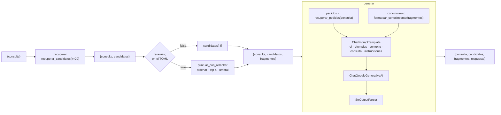

# Fase 3 · Integración y ejecución del código

**Caso:** optimización de la atención al cliente en EcoMarket con generación aumentada por
recuperación
**Autores:** William Alberto Suaza · Anderson Trujillo · Bairon Gutiérrez

---

## 1. Qué construimos

Llevamos a código las decisiones de las fases 1 y 2. El resultado es un asistente de línea de
comandos que conserva la interfaz del Taller 1: recibe el archivo con el mensaje del cliente, un
archivo de configuración y, opcionalmente, un archivo de salida. Por dentro, ahora ejecuta una
cadena RAG completa.

| Archivo                                                            | Responsabilidad                                                                                                                                        |
| ------------------------------------------------------------------ | ------------------------------------------------------------------------------------------------------------------------------------------------------ |
| [src/rag.py](src/rag.py)                                           | Núcleo compartido: carga y segmentación de documentos, embeddings, ChromaDB, recuperación, reranking, búsqueda exacta de pedidos, prompt y cadena LCEL |
| [src/indexar.py](src/indexar.py)                                   | Construye el índice vectorial persistente y, con `--listar`, vuelca los fragmentos a `outputs/indice/fragmentos.md`                                    |
| [src/app.py](src/app.py)                                           | Asistente: ejecuta la cadena para un mensaje y guarda la respuesta con la lista de fragmentos que la sustentan                                         |
| [src/experimento.py](src/experimento.py)                           | Mide la recuperación sin reranking y con reranking sobre 24 consultas etiquetadas                                                                      |
| [src/settings-sin-reranking.toml](src/settings-sin-reranking.toml) | Variante A: los 4 candidatos más similares según el bi-encoder                                                                                         |
| [src/settings-reranking.toml](src/settings-reranking.toml)         | Variante B: los 20 candidatos reordenados por el cross-encoder, con umbral de relevancia                                                               |
| [generar_salidas.sh](generar_salidas.sh)                           | Ejecuta de principio a fin: índice, ocho consultas con ambas variantes y experimento                                                                   |

Las dos configuraciones comparten el modelo, los prompts y los datos. Difieren solo en la sección
`[recuperacion]`, así que cualquier diferencia en los fragmentos que recibe el modelo se debe al
reranking. En la redacción de las respuestas influye además la variabilidad propia del modelo
generativo (sección 8.1).

## 2. Los pasos del flujo RAG en nuestra implementación

Un sistema RAG se organiza en una secuencia de pasos: preparar la base de conocimiento, segmentar,
vectorizar, indexar, recuperar, reordenar los candidatos y generar la respuesta. Seguimos la
arquitectura en tres etapas que trabajamos en clase: recuperación rápida con un bi-encoder,
reordenamiento preciso con un cross-encoder y generación con el contexto resultante. La
implementamos con LangChain y le añadimos lo que exige el caso de EcoMarket: documentos
heterogéneos, recuperación exacta de pedidos y un umbral de abstención. La tabla ubica cada paso
en el código.

| Paso del flujo           | Pieza en nuestra implementación                                                           | Decisión para EcoMarket                                                                                                             |
| ------------------------ | ----------------------------------------------------------------------------------------- | ----------------------------------------------------------------------------------------------------------------------------------- |
| 1. Base de conocimiento  | `construir_base_conocimiento()`, con un cargador por formato                              | Cuatro documentos de la empresa (Markdown, JSON, CSV y PDF) fuera del código: actualizar el conocimiento no exige tocar el programa |
| 2. Modelo de embeddings  | `obtener_embeddings()`: `HuggingFaceEmbeddings` con `intfloat/multilingual-e5-base`       | Modelo multilingüe entrenado para recuperación en español, con prefijos `query:` y `passage:` y vectores normalizados (Fase 1)      |
| 3. Segmentación          | `fragmentar_politica()`, `fragmentar_faq()`, `fragmentar_catalogo()`, `fragmentar_guia()` | Estrategia estructural por tipo de documento, con `RecursiveCharacterTextSplitter` como respaldo (Fase 2)                           |
| 4. Base vectorial        | `abrir_almacen()` y `obtener_almacen()`: Chroma persistente en `src/indice/`, coseno      | El índice se construye una vez con `indexar.py` y se reutiliza; cada fragmento lleva un identificador estable y metadatos           |
| 5. Recuperación          | `recuperar_candidatos()`                                                                  | 20 candidatos por similitud de coseno                                                                                               |
| 6. Reranking             | `puntuar_con_reranker()` y `seleccionar_fragmentos()`                                     | Segunda etapa con cross-encoder y umbral de relevancia, activable desde la configuración                                            |
| 7. Datos transaccionales | `recuperar_pedidos()`                                                                     | Búsqueda exacta por número de seguimiento, como en el Taller 1                                                                      |
| 8. Modelo de lenguaje    | `construir_llm()` con `ChatGoogleGenerativeAI` y `gemini-3.5-flash-lite`                  | Familia Gemini Flash del Taller 1 y el mismo modelo en ambas variantes, para que el efecto medido sea solo el de la recuperación    |
| 9. Cadena                | `construir_cadena()` con LCEL: recuperar → seleccionar → prompt → modelo → texto          | Composición explícita de pasos que devuelve, junto con la respuesta, los fragmentos usados; el prompt es el de Iris                 |
| 10. Interacción          | `app.py` con argumentos de línea de comandos; `cadena.invoke({"consulta": ...})`          | Misma interfaz del Taller 1; cada ejecución queda registrada en `outputs/` con los fragmentos que la sustentan                      |

## 3. Cómo se conectan las piezas

### 3.1 La cadena LCEL

La función `construir_cadena()` de `rag.py` arma la cadena completa. La cadena recibe un
diccionario `{"consulta": ...}` y, en cada eslabón, le agrega una clave nueva. Al final devuelve la
respuesta junto con todo lo que se usó para producirla.

```python
return (
    RunnablePassthrough.assign(candidatos=recuperar)       # etapa 1: bi-encoder + Chroma
    | RunnablePassthrough.assign(fragmentos=seleccionar)   # etapa 2: reranking o corte directo
    | RunnablePassthrough.assign(respuesta=generar)        # prompt → Gemini → texto
)
```



Cada eslabón es un `Runnable` de LangChain, así que la cadena completa también lo es. Esto tiene
tres consecuencias prácticas:

- **La variante se elige por configuración.** `seleccionar_fragmentos()` lee `reranking` del TOML.
  La misma cadena sirve para las dos variantes del experimento, sin duplicar código.
- **La cadena es observable.** `app.py` recibe `fragmentos` en el resultado y los imprime en la
  cabecera de cada salida con su posición vectorial, su similitud y su puntaje del reranker, de modo
  que cada respuesta documenta de dónde proviene.
- **Las piezas son reemplazables.** Cambiar ChromaDB por otra base vectorial, E5 por otro modelo de
  embeddings o Gemini por otro modelo solo requiere modificar una función, no la cadena.

### 3.2 Etapa 1: recuperación vectorial

```python
def recuperar_candidatos(consulta: str, k: int) -> list[Document]:
    resultados = obtener_almacen().similarity_search_with_score(consulta, k=k)
    ...
        metadata = {**documento.metadata, "posicion_vectorial": posicion,
                    "similitud": round(1 - distancia, 4)}
```

`similarity_search_with_score` vectoriza la consulta con el mismo `HuggingFaceEmbeddings` que se
usó al indexar, con el prefijo `query:`, y le pide a Chroma los 20 vecinos más cercanos. Chroma
devuelve la distancia de coseno. La convertimos en similitud ($1 - d$) y guardamos junto con ella
la posición original de cada candidato, para poder ver después cuánto lo movió el reranker.

### 3.3 Etapa 2: reranking

```python
def puntuar_con_reranker(consulta, candidatos, nombre_modelo):
    pares = [(consulta, candidato.page_content) for candidato in candidatos]
    puntajes = obtener_reranker(nombre_modelo).predict(pares)
    ...
    return sorted(puntuados, key=lambda d: d.metadata["puntaje_reranker"], reverse=True)

def seleccionar_fragmentos(consulta, candidatos, recuperacion):
    n = recuperacion["n_finales"]
    if not recuperacion.get("reranking", False):
        return candidatos[:n]
    reordenados = puntuar_con_reranker(consulta, candidatos, recuperacion["modelo_reranker"])
    umbral = recuperacion.get("umbral_relevancia", 0.0)
    if not reordenados or reordenados[0].metadata["puntaje_reranker"] < umbral:
        return []
    return reordenados[:n]
```

El `CrossEncoder` de sentence-transformers recibe cada par (consulta, fragmento) en una sola
entrada. El modelo lee ambos textos juntos y devuelve un puntaje entre 0 y 1. Ordenamos por ese
puntaje y conservamos los cuatro mejores. El umbral se aplica al **mejor** candidato: si ni
siquiera el primero lo alcanza, interpretamos que la base no tiene respaldo para la consulta y la
lista queda vacía. En ese caso, `formatear_conocimiento()` escribe en el bloque CONOCIMIENTO que no
se recuperó información relevante. Esa es la señal que el prompt de Iris convierte en la
clasificación `SIN_INFORMACION_DISPONIBLE`.

Aplicar el umbral a cada fragmento por separado descartaría fragmentos relevantes que complementan
la respuesta, con puntajes bajos pero útiles (sección 5.6). Por eso el umbral decide si hay
respaldo o no, y el orden decide qué se entrega.

Implementamos el reranking como una función propia envuelta en `RunnableLambda` en lugar de usar
`CrossEncoderReranker` de LangChain por dos razones. Ese componente vive hoy en el paquete de
compatibilidad `langchain-classic` y descarta el puntaje, que necesitamos para el umbral y para el
experimento.

### 3.4 Generación

El prompt se construye con `ChatPromptTemplate` en el mismo orden que usamos en el Taller 1:
instrucción de sistema con el rol de Iris, ejemplos etiquetados como turnos humano–asistente,
contexto, consulta e instrucción final. Los textos fijos del TOML se insertan como mensajes ya
construidos (`SystemMessage`, `HumanMessage`, `AIMessage`), de modo que LangChain no intente
interpretar sus llaves como variables. Solo el contexto y la consulta son plantillas. El contexto
conserva los delimitadores del Taller 1:

```
>>>>> INICIO PEDIDOS
{pedidos}
<<<<< FIN PEDIDOS

>>>>> INICIO CONOCIMIENTO
{conocimiento}
<<<<< FIN CONOCIMIENTO
```

`ChatGoogleGenerativeAI` envía la secuencia al modelo configurado en el TOML, `gemini-3.5-flash-lite`,
y `StrOutputParser` extrae el texto de la respuesta.

## 4. Ajustes respecto al Taller 1

| Aspecto                    | Taller 1 (`settings-final.toml`)                         | Taller 2                                                                                                                                                                        |
| -------------------------- | -------------------------------------------------------- | ------------------------------------------------------------------------------------------------------------------------------------------------------------------------------- |
| Cliente del modelo         | `google-genai` directo, con `types.Content`              | `ChatGoogleGenerativeAI` de LangChain, dentro de una cadena LCEL                                                                                                                |
| Contexto documental        | La política de devoluciones completa en cada llamada     | Los cuatro fragmentos más relevantes de cuatro documentos                                                                                                                       |
| Contexto transaccional     | Pedidos citados, por coincidencia exacta                 | Sin cambios: la misma función `recuperar_pedidos()`                                                                                                                             |
| Bloques delimitados        | PEDIDOS y POLITICA_DEVOLUCIONES                          | PEDIDOS y CONOCIMIENTO; cada fragmento lleva su fuente y su sección                                                                                                             |
| Instrucciones              | Diez pasos centrados en estado de pedidos y devoluciones | Nueve pasos para cualquier tema. Iris debe verificar que el fragmento trate exactamente lo que se pregunta, responder solo lo que tiene respaldo y decir qué no puede responder |
| Clasificación de salida    | `RESUELTO_POR_ASISTENTE` o `REQUIERE_AGENTE_HUMANO`      | Se añade `SIN_INFORMACION_DISPONIBLE`                                                                                                                                           |
| Ejemplos etiquetados       | Consulta de pedido y consulta de devolución              | Un ejemplo con un fragmento que sí responde y otro con el bloque CONOCIMIENTO vacío, que enseña a abstenerse                                                                    |
| Configuraciones comparadas | Prompt básico frente a prompt final                      | Sin reranking frente a con reranking, con el mismo prompt                                                                                                                       |
| Salida guardada            | Consulta, configuración, modelo y respuesta              | Se añaden los parámetros de recuperación y la lista de fragmentos entregados con sus puntajes                                                                                   |

## 5. Experimento: sin reranking frente a con reranking

### 5.1 Diseño

**Pregunta.** ¿Cuánto mejora la calidad de los fragmentos que recibe el modelo cuando los
candidatos del bi-encoder se reordenan con un cross-encoder?

**Control de variables.** [src/experimento.py](src/experimento.py) obtiene **una sola vez** los 20
candidatos de cada consulta. La variante A entrega los 4 primeros en el orden de la similitud de
coseno. La variante B reordena esos mismos 20 con `bge-reranker-v2-m3` y entrega sus 4 primeros.
Las dos variantes ven exactamente los mismos candidatos y entregan la misma cantidad de fragmentos.
Lo único que cambia es cómo se ordenan esos 20 candidatos y, por tanto, cuáles cuatro llegan al
modelo. El experimento no llama al modelo generativo, así que es
determinista y no consume cuota de la API.

El reporte incluye además una **variante C**, que es la variante B con el umbral de relevancia
aplicado al mejor candidato, tal como opera `settings-reranking.toml`. La comparación A frente a B
aísla el efecto del reordenamiento. La variante C mide la configuración que realmente se despliega,
incluido el costo de sus abstenciones.

**Conjunto de evaluación.** Redactamos 24 consultas en
[consultas-evaluacion.json](src/datos/evaluacion/consultas-evaluacion.json), distintas de las ocho
consultas de cliente que usamos después para comparar respuestas. Para cada una marcamos los
fragmentos relevantes con dos grados: **2** si el fragmento responde directamente y **1** si
complementa la respuesta.

| Tipo             | Cantidad | Qué pone a prueba                                                            | Ejemplo                                                                                |
| ---------------- | -------- | ---------------------------------------------------------------------------- | -------------------------------------------------------------------------------------- |
| Directa          | 6        | Consultas con el mismo vocabulario del documento                             | «¿Qué métodos de pago aceptan?»                                                        |
| Paráfrasis       | 8        | Lenguaje coloquial y palabras distintas a las del documento                  | «se me olvidó la clave para entrar a la página, qué hago»                              |
| Distractor       | 4        | Consultas cuyo vocabulario coincide con un fragmento que **no** las responde | «¿Les puedo devolver la caja de cartón en la que me llegó el pedido?»                  |
| Multidocumento   | 2        | La respuesta completa exige fragmentos de dos o tres documentos              | «Si mando a grabar el termo con un nombre, ¿lo puedo devolver después si no me gusta?» |
| Fuera de alcance | 4        | Solicitudes sin respuesta en la base, para calibrar el umbral                | «¿Ustedes instalan paneles solares en el techo de las casas?»                          |

### 5.2 Métricas

Sea $g_i$ el grado de relevancia del fragmento en la posición $i$ de los $n = 4$ entregados y $R$ el
conjunto de fragmentos relevantes de la consulta.

| Métrica     | Definición                                                                                                        | Qué indica                                                           |
| ----------- | ----------------------------------------------------------------------------------------------------------------- | -------------------------------------------------------------------- |
| Hit@4       | $1$ si algún $g_i > 0$; $0$ en otro caso                                                                          | Si el modelo recibe al menos un fragmento útil                       |
| MRR@4       | $\frac{1}{r}$, con $r$ la posición del primer fragmento relevante; $0$ si no hay                                  | Qué tan arriba aparece lo primero útil                               |
| nDCG@4      | $\frac{\mathrm{DCG@4}}{\mathrm{IDCG@4}}$, con $\mathrm{DCG@4} = \sum_{i=1}^{4} \frac{2^{g_i} - 1}{\log_2(i + 1)}$ | Calidad del orden completo, premiando lo más relevante en lo alto    |
| Precision@4 | $\frac{\lvert\{i \le 4 : g_i > 0\}\rvert}{4}$                                                                     | Qué proporción del contexto entregado es útil                        |
| Recall@4    | $\frac{\lvert\{i \le 4 : g_i > 0\}\rvert}{\lvert R \rvert}$                                                       | Qué proporción de lo relevante llega al modelo                       |
| Recall@20   | Proporción de $R$ presente entre los 20 candidatos                                                                | Techo de la etapa 1: lo que el reranker puede, como máximo, rescatar |

nDCG@4 es la métrica central del experimento. El aporte esperado de un reranker es ordenar mejor,
no encontrar más, y nDCG es la única de estas métricas sensible a que el fragmento de grado 2 quede
por encima del de grado 1. IDCG@4 es el DCG del orden ideal, así que nDCG vale 1 cuando el orden es
perfecto.

### 5.3 Resultados agregados

El reporte completo generado por el script está en
[outputs/experimento/reporte.md](outputs/experimento/reporte.md) y los valores por consulta, en
[metricas.csv](outputs/experimento/metricas.csv).

Sobre las 20 consultas que tienen respuesta en la base:

| Métrica     | Sin reranking (A) | Con reranking (B) | B − A      | Con reranking y umbral (C) | C − A  |
| ----------- | ----------------- | ----------------- | ---------- | -------------------------- | ------ |
| Hit@4       | 0,900             | 1,000             | +0,100     | 0,900                      | +0,000 |
| MRR@4       | 0,863             | 0,929             | +0,067     | 0,900                      | +0,037 |
| **nDCG@4**  | **0,765**         | **0,908**         | **+0,144** | **0,866**                  | +0,101 |
| Precision@4 | 0,325             | 0,400             | +0,075     | 0,375                      | +0,050 |
| Recall@4    | 0,783             | 0,933             | +0,150     | 0,858                      | +0,075 |

La variante C pierde frente a B dos consultas, P04 y P06. En ambas el reranker había subido el
fragmento correcto al top-4, pero el mejor candidato no alcanza el umbral (0,0033 y 0,0004) y el
sistema se abstiene. Aun con ese costo, la configuración desplegada supera a la línea base en
todas las métricas salvo Hit@4, donde empata, y a cambio identifica tres de las cuatro consultas
fuera de alcance (sección 5.6), algo que la variante A no puede hacer.

El techo de la primera etapa es **Recall@20 = 0,975**: el 97,5% de los fragmentos relevantes llega a
los 20 candidatos. Con reranking, el Recall@4 sube a 0,933, es decir, el reranker lleva a las cuatro
primeras posiciones casi todo lo que la primera etapa encontró.

El reranking mejora nDCG@4 en 10 consultas, lo empeora en 1 y lo deja igual en 9. Para descartar
que ese balance sea casual, aplicamos una prueba de signos a las 11 consultas en las que nDCG@4
cambia. Si el reranking no tuviera efecto, mejorar o empeorar sería igual de probable, y obtener 10
mejoras o más entre 11 casos, o el resultado opuesto, tiene una probabilidad de
$p = 2 \cdot \frac{\binom{11}{0} + \binom{11}{1}}{2^{11}} \approx 0{,}012$. Con 20 consultas la prueba
tiene poca potencia, pero el resultado es significativo al 5%.

Los valores absolutos de Precision@4 son bajos en ambas variantes por construcción: la mayoría de
las consultas tiene uno o dos fragmentos relevantes, así que Precision@4 no puede superar 0,25 o
0,50. Lo informativo es la diferencia entre variantes, no el valor.

### 5.4 Resultados por tipo de consulta

| Tipo           | Consultas | MRR@4 sin | MRR@4 con | nDCG@4 sin | nDCG@4 con |
| -------------- | --------- | --------- | --------- | ---------- | ---------- |
| Directa        | 6         | 1,000     | 1,000     | 0,988      | 0,991      |
| Paráfrasis     | 8         | 0,656     | 0,823     | 0,554      | **0,842**  |
| Distractor     | 4         | 1,000     | 1,000     | 0,913      | 0,957      |
| Multidocumento | 2         | 1,000     | 1,000     | 0,639      | **0,832**  |

**Consultas directas: el reranker casi no aporta.** Cuando el cliente usa las palabras del
documento, el bi-encoder ya pone el fragmento correcto en el primer lugar en las seis consultas.

**Paráfrasis: el reranker aporta más.** Es el tipo de consulta que más se parece a como escriben
los clientes reales, y donde el bi-encoder más falla:

| Consulta                                                                              | Fragmento principal             | Posición sin reranking | Posición con reranking |
| ------------------------------------------------------------------------------------- | ------------------------------- | ---------------------- | ---------------------- |
| «¿en cuánto tiempo me devuelven la plata después de mandarles el producto de vuelta?» | Plazos generales de la política | 5 (fuera de los 4)     | **1**                  |
| «quiero dejar de usar papel film para tapar la comida, ¿qué me sirve?»                | Envolturas de cera de abejas    | 4                      | **1**                  |
| «me mudé y el paquete ya salió de la bodega, ¿me lo pueden llevar a la casa nueva?»   | Cambios de dirección            | 13 (fuera de los 4)    | **3**                  |
| «¿por qué en mi pedido dice que todavía no tiene empresa de mensajería?»              | Transportadoras aliadas         | 14 (fuera de los 4)    | **4**                  |
| «necesito que la cuenta de cobro salga a nombre de mi empresa, ¿se puede?»            | Facturación electrónica         | 2                      | **1**                  |

En los casos con mayor salto, el bi-encoder ve «devolver», «comida», «bodega» o «pedido» y
prioriza fragmentos que comparten esas palabras. El cross-encoder lee la consulta y el fragmento
juntos, y reconoce que «me devuelven la plata» pregunta por el plazo del reembolso, que las
envolturas de cera reemplazan al papel film aunque el cliente nunca diga «cera», que «me mudé»
plantea un cambio de dirección y que «empresa de mensajería» equivale a «transportadora».

**Distractores: el encabezado contextual ya protege la primera posición.** Anticipábamos que este
sería el terreno del reranker. Sin embargo, el bi-encoder acertó el primer lugar en los cuatro
casos. Nuestra hipótesis es que lo explica el encabezado contextual de la Fase 2, aunque no la
aislamos con un experimento sin encabezados: el fragmento del programa «Devuelve
tu caja» empieza con «Preguntas frecuentes > Sostenibilidad» y la pregunta sobre cobros duplicados
recupera un fragmento titulado «Pagos rechazados y cobros duplicados». El reranker mejoró el orden
de los fragmentos complementarios (nDCG de 0,913 a 0,957).

**Multidocumento: el reranker completa el contexto.** En la consulta sobre grabar el termo, el
bi-encoder encontraba la pregunta frecuente sobre personalización, pero no la ficha del termo. El
reranker sube la ficha al top-4 (nDCG de 0,673 a 0,987), y así el modelo recibe la regla general y
el producto concreto.

### 5.5 Casos negativos

- **El único empeoramiento es menor.** En «¿Qué métodos de pago aceptan?», el reranker intercambia
  la posición 3 y la 4. La pregunta frecuente sobre seguridad de pagos, marcada con relevancia 1,
  baja un lugar, y sube la sección de pagos a cuotas, que no marcamos como relevante aunque
  razonablemente lo es. nDCG baja de 0,964 a 0,945.
- **El reranker no rescata lo que la etapa 1 no encontró.** En la consulta P06 sobre la
  transportadora pendiente, el fragmento complementario de tiempos de alistamiento no llega a los
  20 candidatos, y ningún reordenamiento puede traerlo. Es el único fragmento relevante de todo el
  conjunto que se queda fuera, y por eso el Recall@20 es 0,975 y no 1.
- **Mejorar el promedio no garantiza mejorar cada posición.** En «Me llegó el desodorante con el
  sello roto», el fragmento de excepciones baja de la posición 3 a la 4, aunque sigue dentro de los
  cuatro entregados. nDCG mejora porque el reranker sube la ficha del desodorante y la tabla de
  categorías no retornables.

### 5.6 Umbral de relevancia: cuándo decir «no tengo esa información»

EcoMarket necesita que el asistente avise cuando no tiene con qué atender una solicitud. La variante
sin reranking no tiene forma de detectarlo: siempre entrega los cuatro fragmentos más similares,
aunque la consulta sea sobre el precio del dólar. Evaluamos si alguna de las dos puntuaciones
disponibles permite distinguir las consultas con respuesta de las que no la tienen.

| Puntuación del mejor candidato   | Con respuesta (20 consultas) | Fuera de alcance (4 consultas) | ¿Separa?                  |
| -------------------------------- | ---------------------------- | ------------------------------ | ------------------------- |
| Similitud de coseno (bi-encoder) | de 0,811 a 0,917             | de 0,777 a 0,826               | No: los rangos se solapan |
| Puntaje del reranker             | de 0,0004 a 0,9997           | de 0,0000 a 0,0331             | Parcialmente              |

La similitud de coseno de E5 se concentra en un rango estrecho, de 0,78 a 0,92, sea cual sea la
consulta. Por eso no sirve como señal de abstención. El puntaje del reranker, en cambio, se extiende
por casi todo el intervalo de 0 a 1: tres de las cuatro consultas fuera de alcance obtienen menos de
0,001, y 17 de las 20 con respuesta superan 0,06.

**Qué umbral separa mejor el conjunto de evaluación.** Sobre las 24 consultas etiquetadas,
cualquier umbral entre 0,034 y 0,068, por ejemplo 0,05, atrapa las cuatro consultas fuera de
alcance con tres abstenciones indebidas. Pero ese valor no resiste los mensajes de cliente. La
consulta 01, «Me voy de camping… ¿qué me recomiendan, cuánto cuesta y tiene garantía?», obtiene
un puntaje máximo de 0,033, aunque el cargador solar está entre los primeros candidatos. Con un
umbral de 0,05, Iris respondería que no tiene información. Las consultas del conjunto de
evaluación son cortas y tienen una sola intención. Los mensajes reales, como este, combinan tres
preguntas, y el cross-encoder reparte su confianza entre ellas: ningún fragmento responde todo,
así que ninguno obtiene un puntaje alto. La consulta sobre envíos a Leticia muestra lo mismo, con
0,023.

**Umbral adoptado.** Por eso el umbral no tiene la tarea de decidir todos los casos, sino la de
descartar lo **claramente ajeno**. Los casos dudosos quedan para el paso 6 del prompt, que ordena a
Iris abstenerse cuando los fragmentos no responden la pregunta. Con ese criterio fijamos el umbral
en **0,005**:

| Umbral    | Abstenciones correctas (de 4) | Abstenciones indebidas (de 20) | Consultas de cliente bloqueadas por error |
| --------- | ----------------------------- | ------------------------------ | ----------------------------------------- |
| 0,05      | 4                             | 3 (P04, P05, P06)              | 01, 02 y 06                               |
| **0,005** | **3**                         | **2 (P04, P06)**               | **Ninguna**                               |

De las dos abstenciones indebidas, la de P06 tiene el puntaje más bajo de todas las consultas con
respuesta (0,0004), por debajo de dos de las consultas fuera de alcance, así que ningún umbral la
rescata sin dejar pasar lo ajeno. La de P04 queda muy cerca del umbral (0,0033): el reranker sube
el fragmento correcto a la posición 3, pero el mejor candidato no alcanza 0,005. No ajustamos el
umbral para rescatarla, porque sería calibrarlo a una consulta concreta del conjunto que
reportamos. La consulta fuera de alcance que supera el umbral, «¿Tienen vacantes
de trabajo en la bodega de Funza?», menciona una bodega que sí aparece en las preguntas
frecuentes. Ese caso queda en manos del prompt.

El costo de los errores no es simétrico, y eso justifica un umbral bajo. Una abstención indebida
deja sin respuesta a un cliente que preguntaba por un producto del catálogo. Una consulta ajena que
supera el umbral llega a Iris con fragmentos que no la responden, y el prompt le ordena reconocerlo.
Aplicar el umbral al mejor candidato, y no a cada fragmento, también reduce la pérdida de
información. Con el umbral de 0,005, un filtro por fragmento descartaría 5 fragmentos relevantes del
top-4. Con el criterio adoptado, aplicado al mejor candidato, se pierden 2: los de P04 y P06, las
consultas en que el sistema se abstiene.

Esta calibración tiene la limitación que señalamos en la sección 8.2: un umbral calibrado sobre el
mismo conjunto que se reporta resulta optimista. Las ocho consultas de cliente cumplen aquí el
papel de validación, pero al usarlas para fijar el umbral dejan de ser independientes. Confirmar el
valor de 0,005 exige un tercer conjunto de consultas que no hayamos visto.

### 5.7 Costo en latencia

| Etapa                                           | Media por consulta en CPU |
| ----------------------------------------------- | ------------------------- |
| Búsqueda vectorial (embedding + Chroma, k = 20) | 169 ms                    |
| Reranking de 20 candidatos                      | 29.461 ms                 |

Son los valores de la ejecución reportada. En otras ejecuciones medimos entre 76 y 288 ms para la
búsqueda y entre 19,6 y 35,8 s para el reranking; la diferencia se debe a la carga del equipo en
cada momento. Las métricas de recuperación son idénticas entre ejecuciones, porque la recuperación
es determinista; solo cambia el tiempo. El reranker
multiplica por más de 100 el costo de la recuperación. En CPU, la ganancia en nDCG cuesta entre 20
y 36 segundos por consulta. Es aceptable para un asistente que hoy responde en
veinticuatro horas, pero no para un chat en tiempo real. En producción habría tres salidas, de menor
a mayor costo. La primera es bajar k de 20 a 10, que reduce la latencia a la mitad pero renuncia a
rescates como los de P04 y P06, cuyos fragmentos venían de las posiciones 13 y 14. La segunda es cambiar a un reranker
liviano, recalibrando el umbral porque su escala de puntajes es distinta. La tercera es ejecutar el
reranker en GPU.

## 6. Efecto en las respuestas de Iris

Las métricas muestran que el contexto mejora, pero lo que percibe el cliente es la respuesta. Para
observar el cambio en el **comportamiento del asistente** ejecutamos ocho consultas de cliente nuevas,
que no forman parte del conjunto de evaluación, con las dos configuraciones. Modelo, prompt, datos y
candidatos son idénticos. El modelo aplica parámetros de muestreo fijos que no controlamos (sección
8.1). Por eso atribuimos al reranking solo las diferencias que se explican por los fragmentos
entregados, que sí son deterministas, y no las diferencias de redacción. Las respuestas completas,
con la lista de fragmentos que recibió el modelo en cada caso, están en
[outputs/sin-reranking](outputs/sin-reranking) y [outputs/reranking](outputs/reranking).

| Consulta                                                | Sin reranking                                                                                                                                                                      | Con reranking                                                                                                                                     | Resultado               |
| ------------------------------------------------------- | ---------------------------------------------------------------------------------------------------------------------------------------------------------------------------------- | ------------------------------------------------------------------------------------------------------------------------------------------------- | ----------------------- |
| 01 · Cargador para camping, precio y garantía           | Recomienda el cargador solar con precio y garantía correctos                                                                                                                       | Igual, y suma la pregunta frecuente de garantía, que aclara que las reclamaciones las atiende un agente                                           | Mejora de completitud   |
| 02 · ¿Envían a Leticia? ¿Cuánto cuesta y tarda?         | Recibe tarifas y tiempos por zona, pero no la lista de ciudades de cada zona: no puede ubicar a Leticia y lo reconoce, aunque clasifica la respuesta como `RESUELTO_POR_ASISTENTE` | El fragmento de cobertura sube de la posición 5 a la 1: confirma que Leticia es Zona 3, 24.900 pesos y de 6 a 10 días hábiles                     | **Mejora decisiva**     |
| 03 · Nequi, efectivo y cuotas                           | Correcta                                                                                                                                                                           | Correcta, con los mismos fragmentos; «Métodos de pago» sube de la posición 3 a la 2                                                               | Igual                   |
| 04 · «eso de los puntos cómo es?»                       | Explica el programa Semilla y remite a «Mi cuenta»                                                                                                                                 | Entra la pregunta frecuente sobre compras como invitado, e Iris advierte que esas compras no suman puntos                                         | Mejora de completitud   |
| 05 · No me devolvieron lo que pagué de envío            | Correcta: el fragmento sobre el reembolso del envío estaba en la posición 2, detrás de las excepciones de la política                                                              | El fragmento correcto pasa al primer lugar y la respuesta enumera en qué casos sí se reembolsa el envío                                           | Mejora de completitud   |
| 06 · Pedido ECO-2026-1372, el café llegó regado         | Aplica la excepción por producto averiado, no exige devolver el café y pide una foto, pero clasifica la respuesta como `REQUIERE_AGENTE_HUMANO` sin que la política lo exija       | Mismo contenido, pero el reranker pone primero el programa «Devuelve tu caja» y saca del contexto la tabla de categorías no retornables           | **Empeora el contexto** |
| 07 · Chaqueta de regalo: ¿devolución? ¿envío a Pereira? | Responde la devolución, pero dice no tener información sobre el costo del envío a Pereira                                                                                          | Suben la tabla de costos (14 → 3) y la de cobertura (12 → 4): Pereira es Zona 1 y la chaqueta de 289.000 pesos supera el mínimo para envío gratis | **Mejora decisiva**     |
| 08 · Quiero ser proveedor, ¿qué comisión cobran?        | Se abstiene: `SIN_INFORMACION_DISPONIBLE`                                                                                                                                          | Supera el umbral (0,010), pero los fragmentos no responden y el prompt hace que Iris se abstenga                                                  | Igual                   |

### 6.1 Qué muestran los casos

**Las mejoras decisivas aparecen en las consultas con más de una pregunta.** En las consultas 02 y
07, el cliente pregunta por dos cosas que viven en fragmentos distintos. El bi-encoder llena los
cuatro puestos con lo más parecido a la consulta completa y deja fuera el fragmento que resuelve la
segunda pregunta. El cross-encoder evalúa cada fragmento frente a la consulta y reconoce que la
lista de ciudades por zona es necesaria para responder «¿envían a Leticia?», aunque se parezca poco
al conjunto de la consulta. Sin reranking, Iris no inventa: reconoce que le falta información. El
reranking no la hace más confiable, la hace **más útil**.

**Cuando el bi-encoder ya acierta, el reranking no cambia la respuesta.** En las consultas 03 y 08
las respuestas son equivalentes. Esto coincide con las métricas de la sección 5.4 para las
consultas directas.

**El caso negativo es real y tiene una causa identificable.** En la consulta 06, «el grano venía
regado por toda la caja… ¿Les tengo que mandar el café de vuelta?» comparte palabras y sentido con
«¿Puedo devolverles la caja en la que llegó mi pedido?». Allí el cross-encoder cayó en el
distractor que el bi-encoder había resistido, y la tabla de categorías no retornables salió del
top-4. La excepción de la política llegó en la segunda posición e Iris aplicó la regla correcta en
ambas variantes. Lo atribuible al reranking es el deterioro del contexto, no un error en la
respuesta. El reranker también es un modelo estadístico: reduce los errores de orden, no los
elimina.

**El reranking mejora el contexto, no la lectura del modelo.** En la consulta 06 sin reranking,
Iris recibió la excepción y la tabla de categorías no retornables, redactó bien la solución y aun
así clasificó el caso como `REQUIERE_AGENTE_HUMANO`, aunque la política no lo exige. En la
consulta 02 sin reranking reconoció que no podía confirmar el envío a Leticia, pero clasificó la
respuesta como resuelta. En los dos casos el contexto era suficiente para la clasificación correcta:
el error es de interpretación del modelo generativo. Esto refuerza la validación automática de la
respuesta que propusimos en la arquitectura del Taller 1: el RAG reduce las alucinaciones por falta
de información, pero no las que ocurren al interpretar la información recibida.

**Los pedidos no dependen del reranking.** En la consulta 06, ambas variantes identificaron el
pedido `ECO-2026-1372`, su titular y el café del pedido, porque ese dato llega por búsqueda exacta
y no por similitud.

En balance, en ocho consultas el reranking produjo dos mejoras decisivas, tres mejoras de
completitud, dos resultados iguales y un deterioro del contexto. Ocho consultas bastan para
ilustrar los mecanismos, pero no para estimar con precisión cuánto mejora la calidad de las
respuestas. Esa estimación la aportan las métricas de recuperación de la sección 5.

## 7. Ejecución

Las instrucciones completas de instalación están en el [README](README.md). En resumen:

```bash
python src/indexar.py --listar                    # construye el índice (una vez)
python src/app.py src/datos/consultas/07-multi-documento.txt \
  --configuracion src/settings-reranking.toml     # una consulta con reranking
python src/experimento.py                         # métricas de recuperación, sin API
./generar_salidas.sh                              # todo el flujo y las 16 respuestas
```

## 8. Limitaciones y suposiciones

### 8.1 Limitaciones de recursos

| Limitación                 | Causa                                                                                                                                                                                                       | Efecto en lo presentado                                                                                                                                                       | Qué haríamos con más recursos                                                                            |
| -------------------------- | ----------------------------------------------------------------------------------------------------------------------------------------------------------------------------------------------------------- | ----------------------------------------------------------------------------------------------------------------------------------------------------------------------------- | -------------------------------------------------------------------------------------------------------- |
| Sin GPU                    | El equipo disponible es un portátil con CPU de 16 hilos y 16 GB de RAM                                                                                                                                      | El reranking tarda entre 20 y 36 s por consulta y el flujo completo de `generar_salidas.sh` tarda alrededor de media hora                                                     | Ejecutar embeddings y reranker en GPU, o servirlos desde un proceso persistente con los modelos cargados |
| Memoria                    | Los dos modelos abiertos ocupan cerca de 3 GB en disco y 2,5 GB en RAM en precisión completa; `bfloat16` resultó más lento en esta CPU                                                                      | Se usan en `float32`                                                                                                                                                          | Cuantizar el reranker o usar hardware con soporte nativo de `bfloat16`                                   |
| Cuota de la API de Gemini  | El nivel gratuito de `gemini-3.6-flash`, el modelo del Taller 1, admite 20 solicitudes diarias por proyecto, que no alcanzan para las 16 respuestas de una ejecución completa más las pruebas de desarrollo | Las 16 respuestas se generaron con `gemini-3.5-flash-lite`, de la misma familia. Comparamos respuestas en 8 consultas, no en las 24 del experimento, y sin un juez automático | Usar un plan de pago con `gemini-3.6-flash` y evaluar la fidelidad de las respuestas a mayor escala      |
| Temperatura no controlable | La integración de LangChain advierte que estos modelos usan parámetros de muestreo fijos e ignora la temperatura                                                                                            | Las respuestas pueden variar entre ejecuciones; las de `outputs/` corresponden a una ejecución concreta                                                                       | Repetir cada consulta varias veces y reportar la variabilidad                                            |

### 8.2 Limitaciones metodológicas

- **Conjunto de evaluación pequeño y etiquetado por el propio equipo.** Veinticuatro consultas
  bastan para ver tendencias claras, pero una sola consulta mueve el promedio de su tipo en varios
  puntos. El etiquetado de relevancia contiene juicios nuestros; la sección de pagos a cuotas del
  caso D05 muestra que otro anotador habría marcado distinto.
- **Las decisiones de diseño se evaluaron con el mismo conjunto que se reporta.** El umbral se
  fijó con las 24 consultas etiquetadas y las ocho consultas de cliente, y la segmentación se
  validó con las mismas 24 consultas. Los resultados son, por tanto, optimistas. Un despliegue real
  debe confirmarlos con consultas nuevas y revisar el umbral con el registro de conversaciones.
- **Documentos ficticios y coherentes.** Redactamos los cuatro documentos cuidando que no se
  contradijeran. Los documentos reales de una empresa tienen versiones superpuestas, erratas y
  formatos irregulares que harían más difícil la recuperación.
- **Sin búsqueda híbrida.** Una consulta por SKU exacto depende solo de la similitud semántica. En
  la Fase 1 identificamos este caso como disparador para migrar a una base con BM25 integrado.
- **Sin memoria de conversación.** Cada mensaje se atiende de forma independiente. Una pregunta de
  seguimiento como «¿y cuánto cuesta?» no tiene contexto.

### 8.3 Suposiciones

- Los cuatro documentos son la fuente vigente de verdad y el índice se reconstruye cada vez que
  alguno cambia.
- Los clientes escriben en español y cada mensaje contiene una consulta completa.
- Los pedidos se identifican siempre con el formato `ECO-AAAA-NNNN`. Un cliente que no tenga el
  número recibe la indicación de buscarlo en su correo de confirmación.
- Una latencia de decenas de segundos es aceptable en esta etapa, porque el punto de comparación es
  el tiempo de respuesta actual de veinticuatro horas.
- La anonimización previa y la validación automática de la respuesta que propusimos en la
  arquitectura del Taller 1 siguen siendo necesarias en producción. Este taller no las implementa.

## 9. Conclusiones

- **El RAG amplía el alcance de Iris sin sacrificar lo que ya funcionaba.** Los pedidos se siguen
  resolviendo por número exacto. El resto del conocimiento llega en cuatro fragmentos de unos 800
  caracteres, en lugar de un documento completo por llamada, y cubre catálogo, envíos, pagos y
  preguntas frecuentes, que el Taller 1 no podía atender.
- **El reranking mejora la calidad del contexto donde más importa.** nDCG@4 sube de 0,765 a 0,908, y a 0,866 con el umbral de abstención activo.
  La ganancia se concentra en las paráfrasis y en las consultas que necesitan varios documentos, es
  decir, en la forma en que escriben los clientes reales. En las consultas que repiten el
  vocabulario del documento, el bi-encoder ya basta.
- **El reranker solo mejora lo que la segmentación permite.** Con un fragmento por sección, el
  97,5% de los fragmentos relevantes llega a los 20 candidatos, y el reranker lleva casi todos al
  top-4. Lo que la etapa 1 no encuentra, ningún reordenamiento lo rescata. El buen desempeño en los
  distractores probablemente se debe al encabezado contextual. La Fase 2 condiciona el resultado de
  la Fase 3.
- **El puntaje del reranker es una señal de abstención que la similitud de coseno no ofrece**,
  pero debe calibrarse con mensajes reales. Un umbral que separa bien las consultas cortas
  bloquearía consultas legítimas de varias preguntas. La combinación que adoptamos es un umbral bajo
  para lo claramente ajeno y una instrucción explícita en el prompt para los casos dudosos.
- **La precisión tiene un precio en latencia.** En CPU, el reranker multiplica por más de 100 el
  tiempo de recuperación. La arquitectura deja ese costo en un parámetro de configuración: el modelo
  de reranking, k y el umbral se ajustan en el TOML sin tocar el código.
